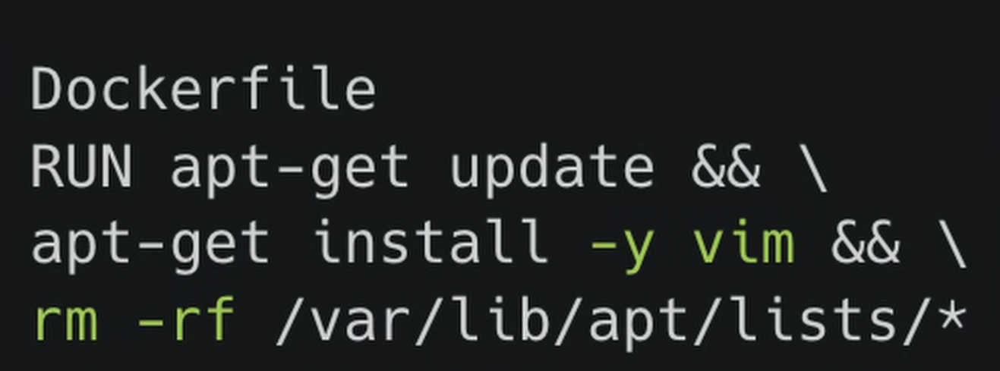
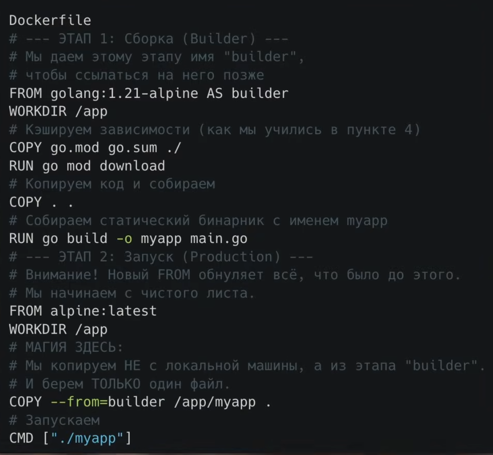
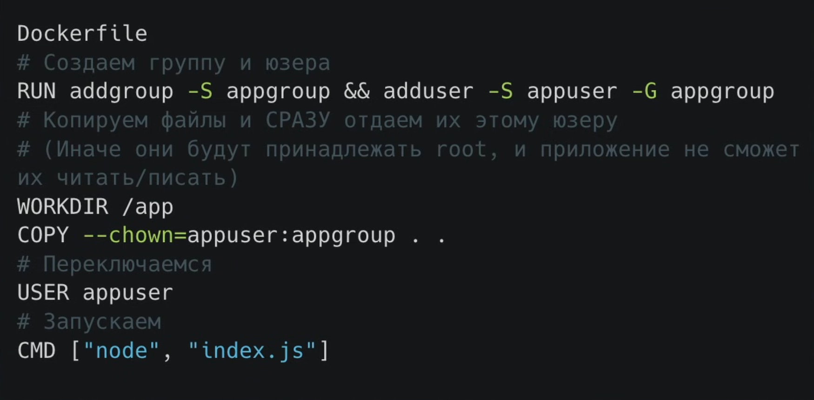
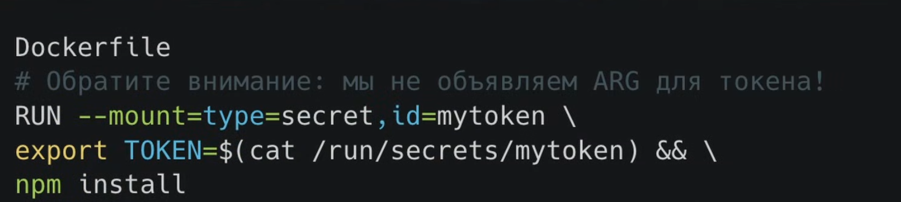
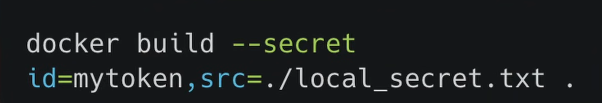
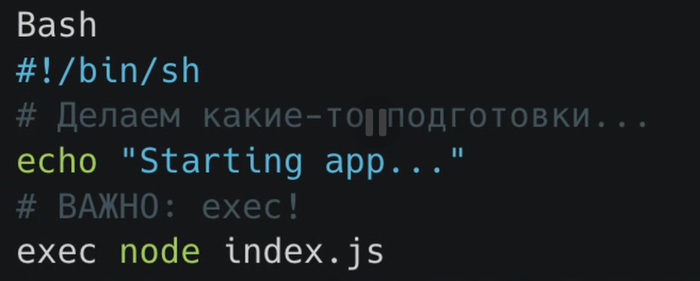
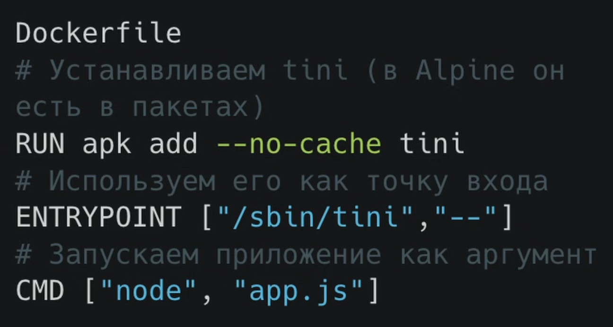
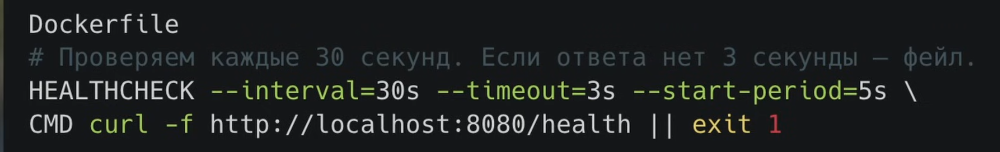
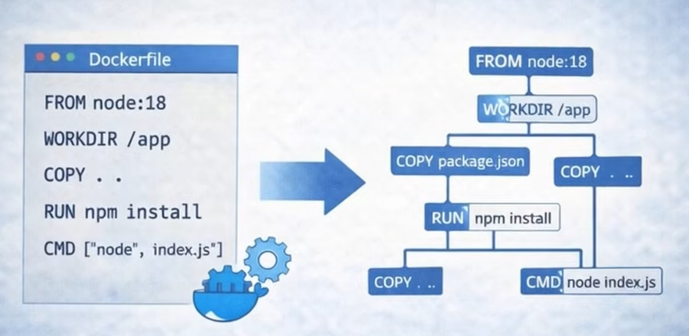

# BEST PRACTICE
# Начало
первая команда в любом docker-файле - это "FROM"
## Первый момент best practice
выбирать минимально возможный образ.
Есть 3 пути: 
1) alpane linux. Низкий вес, много что вырезано. Вместо стандартной библиотеки "glibc" используется "musl libs"
2) sl1m версии. Простая версия Debian под капотом. Все лишнее вырезано. библиотека "glibc"\
3) Destormans от google. Там ничего нет. Даже если хакер взломает - ему это ничего не даст т.к. ему даже негде выполнять команды
, но это также и минус для нас.
## Второй момент Тег latest
сюда нужно дописать информацию про конфликты версий и т.д.
## 3-й момент Использование .dockerignore
Пишем все то что нужно проигнорировать во время сборки
## Правило docker
если был изменен один слой, то все остальные считаются не валидными и пересобираются с нуля.

Каждая команда RUN создает новый слой только для чтения.
Чтобы например тот же процесс обновление пакетов->установление vim-> очистка лишнего (и docker не таскал лишнее удаленное) используют '&&' и '\'
 

 ### Частый вопрос собесов
 В чем разница между COPY и ADD?
 ADD - наследие ранних версий докера. Мы можем дать ей локальный архив и она молча распакует его в контейнер. Нос копировать просто архив как файл у нас не получится, с другой стороны мы модем дать ей URL и она скачает по нему, но это антипаттерн (вызывает проблемы с кешем и непредсказуемость). Мы смотрим в код и не понимаем что произойдет (копирование или распаковка), а про проблемы с кешем - docker при url будет делать каждый раз запрос к серверу чтобы проверить метаданные к файлу.
 ## Четвертый момент. Всегда используем COPY для переноса локальныйх файлов.
 ## Пятый момент. Multi-stage builds
 Прогеры пишут код, чтобы его превратить в программу нужны менеджеры зависимости, SDK, заголовочные файлы, компиляторы и т.д. 
 

 ## новый сборщик файлов build-kit
 Он строит граф зависимостей.
 Также можно кэшировать папки между разными сборками.
 Добавляем переменную окружения
 ```bash
DOCKER_BUILDKIT=1 docker build .
 ```
 ## Шестой момент. Всегда создаем непривилегированного пользователя и переключаемся на него
 
 Даже если нас взламают и вырвятся из контейнера - хакер будет никем без root прав. 
 ## Седьмой пункт. Использовать механизм Build Secrets (требует BuildKit)
 Работает по факту как временная флешка
 
 Команда для запуска такого образа:
 
 Как это работает физически: BuildKit берет файл с секретом с нашего хоста -> Монтирует его в папку внутри контейнера и выполняет только вместе с конкретной командой RUN -> команда выполняется -> слой фиксируется, но смонтированного файла уже нет (наш файл с секретом не попал в файловую систему образа).

 Собрать образ - пол дела, нужно сделать так чтобы приложение вело себя предсказуемо когда оркестратор решит его остановить или перезапустить.
 Представим ситуацию:
 1) Мы выкатываем новую версию приложения которая крутится в кубере
 2) Нужно остановить старый pod и кубер посылаем команду сиктерн чтобы вежливо попросить остановиться, сохраниь все, закрыть текущие запросы и тд
 3) Чаще всего его не слышат и тогда он спустя 30 секунд посылает 
 4) Кубер посылает сиккил и процесс убивается мгновенно.
 5) Пользователь получит ошибку транзакции и тд. Во всем винова piId1. Чаще всего приложение даже не знает что его пытаются остановить. и существует 2 решения: 

Она не создает новый процесс, а замещает текущий нашим.
Путь 2 - использовать tini - это крошечный init процесс, который встроен в docker 

tini - умный, он также собирает zombi-процессы.
## Восьмой пункт. Научить контейнер сообщать о своем самочувствии через инструкцию HEALTHCHECK

## Ходулинк для статического анализа

Она парсит синтаксическое дерево докер-файла и бьет по рукам за ошибки. 

# 3 кита любого докер файла
1) скорость
2) безопасность
3) надежность
