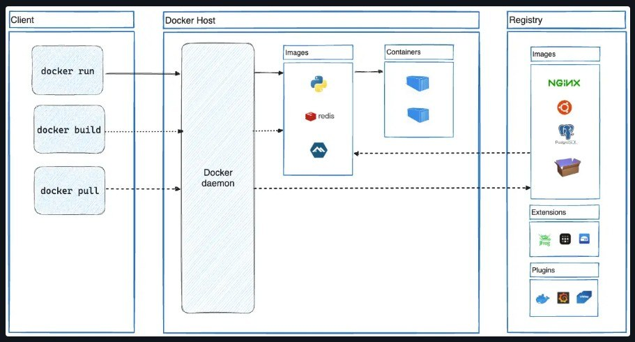

# 📘 Что такое Docker

> Полное руководство по основам Docker: платформа, архитектура, объекты и принципы работы.  
> Перевод и структурирование официальной документации.

---

## 🧠 Что такое Docker

**Docker** — это открытая платформа для разработки, доставки и запуска приложений. Docker позволяет отделить приложения от инфраструктуры, чтобы доставлять программное обеспечение быстрее.

С Docker можно управлять инфраструктурой так же, как и приложениями. Используя методологии Docker для доставки, тестирования и развёртывания кода, можно значительно сократить время между написанием кода и его запуском в продакшене.

---

## 🚀 Для чего использовать Docker

### 1. Быстрая и стабильная доставка приложений

Docker упрощает жизненный цикл разработки, позволяя разработчикам работать в стандартизированных окружениях с помощью локальных контейнеров. Контейнеры отлично подходят для CI/CD-процессов.

**Пример сценария:**
- Разработчики пишут код локально и делятся работой через Docker-контейнеры.
- Они отправляют приложения в тестовую среду и запускают автоматические и ручные тесты.
- При обнаружении ошибок их можно исправить в среде разработки и повторно развернуть в тестовой среде.
- После завершения тестирования обновление попадает к клиенту через обновлённый образ.

---

### 2. Гибкое развёртывание и масштабирование

Контейнеры Docker могут работать:
- На локальном ноутбуке разработчика
- На физических или виртуальных машинах в дата-центре
- У облачных провайдеров
- В гибридных средах

Лёгкость и переносимость Docker позволяют динамически управлять нагрузкой, масштабируя приложения в реальном времени.

---

### 3. Больше нагрузки на том же оборудовании

Docker — лёгкий и быстрый. Это экономичная альтернатива гипервизорным виртуальным машинам. Он позволяет использовать больше серверных мощностей для достижения бизнес-целей. Docker идеален для сред с высокой плотностью размещения и для малых/средних развёртываний.

---

## 🏗️ Архитектура Docker

Docker использует клиент-серверную архитектуру:

- **Docker client** — общается с Docker daemon.
- **Docker daemon** (`dockerd`) — выполняет основную работу: сборку, запуск и распространение контейнеров.
- Клиент и демон могут работать на одной системе, либо клиент может подключаться к удалённому демону.
- Общение происходит через REST API, UNIX-сокеты или сетевой интерфейс.
- **Docker Compose** — ещё один клиент для работы с приложениями из нескольких контейнеров.

---

## 🖼️ Схема архитектуры Docker



### Компоненты на схеме:

| Компонент | Описание |
|-----------|----------|
| **Client** | `docker run`, `docker build`, `docker pull` |
| **Docker Host** | Docker daemon, Images, Containers |
| **Registry** | Хранилище образов (Docker Hub, приватные registry) |

---

## ⚙️ Docker daemon (`dockerd`)

Демон Docker слушает API-запросы и управляет объектами Docker: образами, контейнерами, сетями и томами. Демон может общаться с другими демонами для управления Docker-сервисами.

---

## 🖥️ Docker client

Основной способ взаимодействия пользователей с Docker. Команды (`docker run`, `docker build`) отправляются демону, который их выполняет через Docker API. Клиент может работать с несколькими демонами.

---

## 💻 Docker Desktop

Приложение для macOS, Windows и Linux, которое включает:
- Docker daemon
- Docker client
- Docker Compose
- Docker Content Trust
- Kubernetes
- Credential Helper

---

## 📦 Docker registries

Реестр Docker хранит образы. **Docker Hub** — публичный реестр, используемый по умолчанию. Можно также запустить собственный приватный реестр.

- `docker pull` — скачать образ из реестра.
- `docker push` — отправить образ в реестр.

---

## 🧩 Объекты Docker

При работе с Docker создаются и используются: образы, контейнеры, сети, тома, плагины и другие объекты.

---

### 📄 Images (образы)

**Образ** — это шаблон (read-only) с инструкциями по созданию контейнера. Часто образ строится на основе другого образа с дополнительной настройкой.

**Пример:** образ на основе Ubuntu с установленным Apache и вашим приложением.

Образ создаётся через **Dockerfile**. Каждая инструкция в Dockerfile создаёт **слой**. При изменении Dockerfile пересобираются только изменённые слои — это делает образы лёгкими и быстрыми.

---

### 📦 Containers (контейнеры)

**Контейнер** — запущенный экземпляр образа. Можно:
- Создавать, запускать, останавливать, перемещать, удалять
- Подключать к сетям и томам
- Создавать новый образ на основе состояния контейнера

Контейнер изолирован от других контейнеров и хоста. Можно контролировать степень изоляции сети, хранилища и других подсистем.

Контейнер определяется образом и конфигурацией при создании/запуске. При удалении контейнера все изменения, не сохранённые в постоянном хранилище, исчезают.

---

### 🏃 Пример: `docker run`

```bash
docker run -i -t ubuntu /bin/bash
```
Что происходит:
1) Если образ `ubuntu` отсутствует локально — Docker скачивает его из реестра (как `docker pull ubuntu`).
2) Docker создаёт новый контейнер (как `docker container create`).
3) Docker выделяет контейнеру read-write файловую систему как финальный слой. Это позволяет контейнеру создавать/изменять файлы.
4) Docker создаёт сетевой интерфейс и подключает контейнер к сети по умолчанию. Контейнер получает IP-адрес и может выходить в интернет через хост.
5) Docker запускает контейнер и выполняет `/bin/bash`. Флаги `-i -t` делают контейнер интерактивным и привязанным к терминалу.
6) При вводе `exit` контейнер останавливается, но не удаляется. Его можно перезапустить или удалить.

## 🧠 Технологии под капотом
Docker написан на Go и использует возможности ядра Linux:

**Namespaces** — создают изолированное рабочее пространство (контейнер). Каждый аспект контейнера работает в отдельном namespace с ограниченным доступом.

**Control groups (cgroups)** — ограничивают ресурсы (CPU, память, дисковый ввод-вывод).

**Union filesystems** — обеспечивают слоистую структуру образов.

## 📌 Ключевые выводы
| Понятие | Суть |
|---------|------|
| **Docker** | Платформа для контейнеризации приложений |
| **Образ (Image)** | Шаблон для создания контейнера (read-only) |
| **Контейнер (Container)** | Запущенный экземпляр образа |
| **Docker daemon** | Серверная, управляет объектами |
| **Docker client** | CLI-интерфейс для управления Docker |
| **Registry** | Хранилище образов (Docker Hub и др.) |
| **Dockerfile** | Файл с инструкциями для сборки образа |