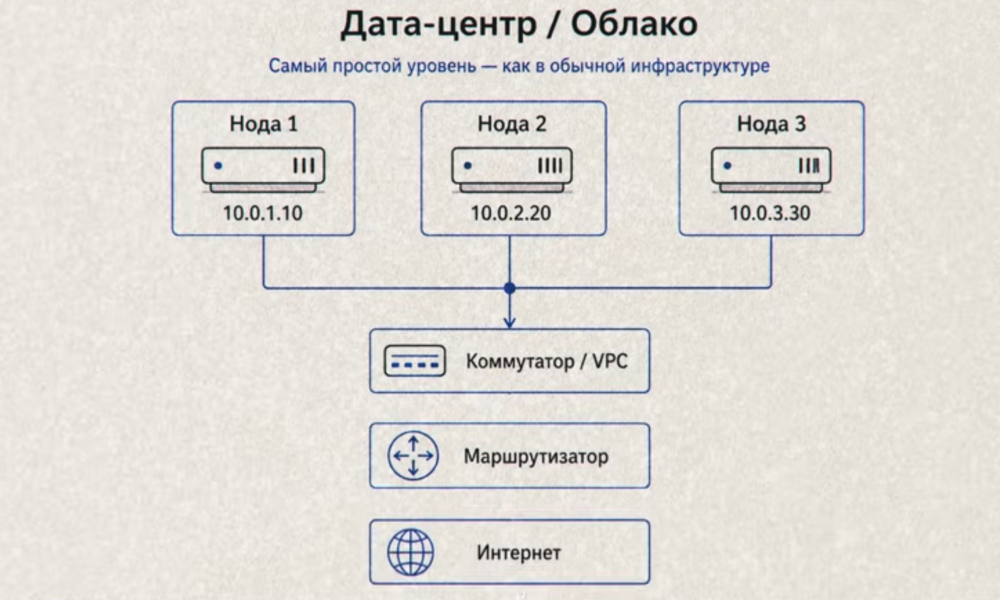
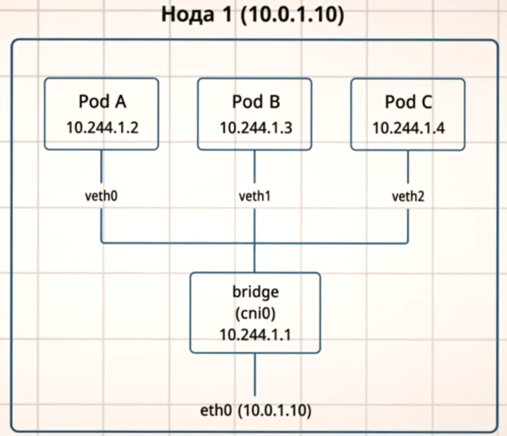
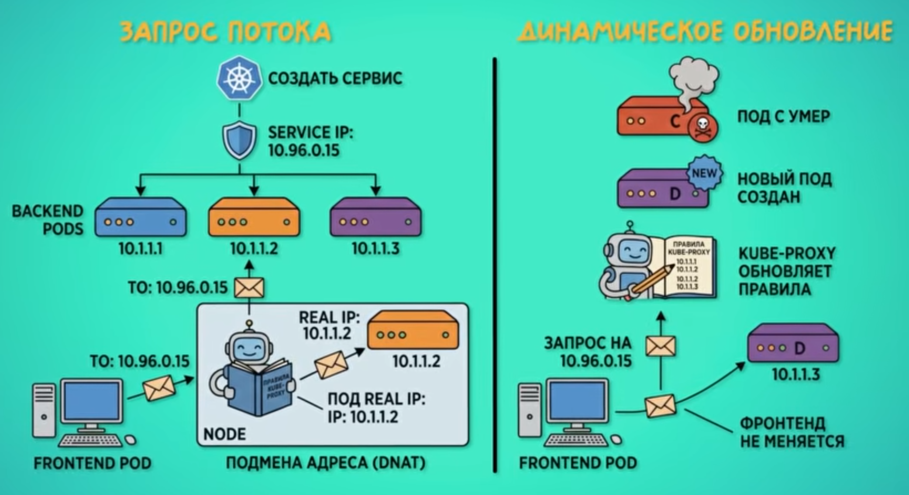
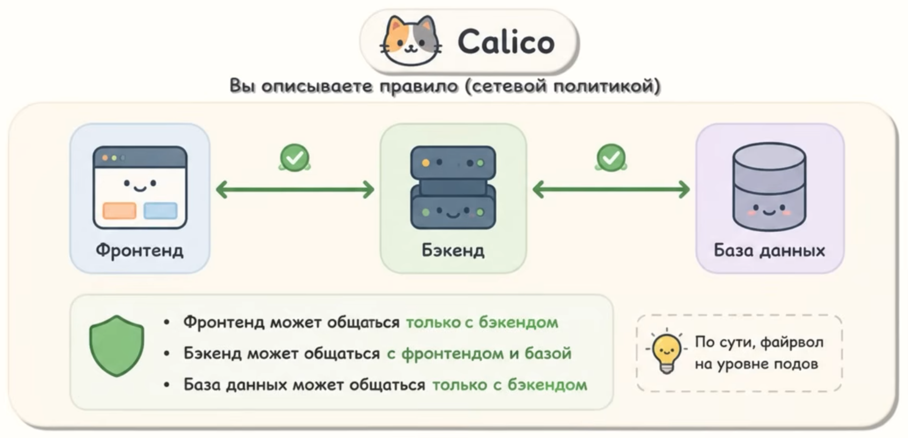

# Сети в Kubernetes

# 📚 Оглавление
- [Сети в Kubernetes](#сети-в-kubernetes)
- [📚 Оглавление](#-оглавление)
  - [Проблемы](#проблемы)
  - [Кластер kubernetes](#кластер-kubernetes)
  - [Сами сети кубера](#сами-сети-кубера)
  - [Сеть между нодами](#сеть-между-нодами)
  - [Сеть между подами](#сеть-между-подами)
  - [CNI (Contaiber Network Interface)](#cni-contaiber-network-interface)
  - [Сервисы и kube-proxy. Стабильные адреса для нестабильных подов.](#сервисы-и-kube-proxy-стабильные-адреса-для-нестабильных-подов)
  - [Типы kubernetes сервисов](#типы-kubernetes-сервисов)
  - [Популярные CNI](#популярные-cni)
  - [Service mesh. Зачем еще один слой?](#service-mesh-зачем-еще-один-слой)

В его задачи входит такая шутка, как *Оркестрация*. Он:
- Запускает контейнеры
- Перезапускает упавшие
- Следит за их количеством
- Распределяет по серверам

**Pod** - базовая единица. В поде может быть несколько контейнеров.

**Node** - место, где запускаютмся поды, т.е. сами сервера.

## Проблемы

- Подды эфимерны, т.е. постоянно создаются и уничтожаются, каждый раз меняя IP-адрес, их кол-во может меняться, они могут переезжать с ноды на ноду в зависимости от нагрузки.
- Связь нод. Они должны общаться между собой и Control Plane.
- Связь pod-to-pod. Поды на разных нодах должны видеть друг друга. Но у pod'ов свои IP, которые обычная сеть не знает.

## Кластер kubernetes

- сердце это *Control Plane*, где живут API-сервер, Планировщик, etcd (база), Контроллеры
- управление это *Worker-нода*, рабочие серверы, где запускаются поды. Состоит из kubelet (агент, который общается с control plane и запускает поды), container runtime (реально запускает контейнеры), kube-proxy (отвечает за сервисы)

## Сами сети кубера

- Сеть нод (обычная серверная сеть, существует до кубера)
- Сеть подов (свое адресное пространство, создает CNI-Плагин)
- Сеть сервисов (Виртуальные стабильные IP)

> По факту kubernetes сам сеть не строит, он просто задает требования, а реализация ложиться на CNI Plagin.

## Сеть между нодами

Эта сеть настраивается до kubernetes.

> Node ничего не знает о Pod! Маршрутизатор между node'ами не знает куда слать пакет на адрес какого-то pod'а

Вырисовывается проблема: как доставить пакет от одного pod'а другому если они находятся на разных node'ах, а сеть между нодами про них вообще не в курсе.

## Сеть между подами

Когда на ноде запускается под, для него создается виртуальный сетевой интерфейс (витая пара).

Все поды подключены к мосту - по сути коммутатору, просто виртуальному. Когда под хочет отправить пакет соседнему поду - запрос идет к мосту и не выходя наружу перенаправляется на другой под.

2 идеи реализации общения между подами на разных нодах:
1. **vxlan** (overlay) - заворачивать внутренний пакет во внешний. Во внутреннем IP пода, а во внешнем IP ноды.
2. Прописывать ручками маршруты. Если адрес из такой подсети, то отправлять на вот такую ноду.

> BGP - метод маршрутизации для автоматического распространения маршрутов про который я рассказывал вот [тут](../Сети/Все_про_сети.md) 

Существует еще много способов реализации: Flannel, Calico, Cilium, Weave, AWS, VPC, CNI

*Почему не используется NAT?*

Потому что многие вещи не будут работать потому что на выходе все будут видеть только адрес node'ы, а не конкретного пода, который на ней находится.

## CNI (Contaiber Network Interface)

Стандарт, по которому кубер общается с сетевым плагином. Кубер создает правило: у каждого пода свой IP и все общаются без NAT.

Жизненный циел pod'а:
1. Программист хочет запустить pod.
2. API-сервер принимает, планироващик выбирает ноду
3. kubelet на ноде получает задание
4. Для выполнения этого задания вызывается CNI-плагин
5. CNI-плагин делает работу: 
   - создает veth-пару
   - подключает один конец к поду, другой к bridge
   - выдает поду IP из пула (10.244.1.5)
   - прописывает маршруты
   - настраивает правила файрвола
6. kubelet запускает контейнер (под живет, обрабатывает запросы)
7. Если под удаляется, то kubelet тоже вызывает CNI-плагин, который:
   - удаляет veth-пару
   - возвращает IP в пул
   - чистит маршруты и правила

## Сервисы и kube-proxy. Стабильные адреса для нестабильных подов.

*Помним что поды эфимерны, тогда на какой IP слать запросы?*

Сервисам выделяется фиксированный виртуальный IP который не меняется пока сервис существует.

Весь процесс подробно:

1. Мы создем сервис и кубер выдает ему IP адрем (например 10.96.0.15)
2. За этим адресом стоят 3 бэкэнда (10.1.1.1, 10.1.1.2, 10.1.1.3)
3. Фронтенд отправляет запрос на сервис 10.96.0.15 и kube-proxy перехватывает этот запрос и подменяет адрес назначения на IP реального пода (это DNAT по сути)
4. Если под будет удален например, то kube-proxy обновит правила

## Типы kubernetes сервисов 

Решают проблему, которая не решается на уровне CNI - дают стабильный IP-адрес группе постоянно меняющихся подов.

1. **Clusterip**
   - Виртуальный IP, доступный только внутри кластера.
   - Дефолтный тип.
   - Сервисы общаются между собой через него
2. **Nodeport**
   - Открывает порт на каждой ноде кластера
   - Запрос на любую ноду на этот порт попадает в нужный под
   - Грубый способ пустить внешний трафик внутрь
3. **Loadbalancer**
   - Создает внешний балансировщик (в облаке)
   - Запрос из интернета приходит на балансироващик, оттуда - к подам
   - Стандартный способ выставить серсис наружу в облаке.

> Существует **Ingress** (Отдельный контроллер)
> Не тип сервиса, а контроллер для http-трафика. Маршрутизирует по доменам и путям.

## Популярные CNI

1. ***Flannel.*** Использует overlay через vxlan, под обворачивается в пакет.

Ноды разделяются на подсети и инфа о каждой ноде хранится у flannel в его ETCD и когда один под отправляет пакет на определенный адрес - flannel просто посмотрит на подсеть куда идет запрос, завернет в vxlan и отправит куда нужно.

минус в том что пока будут заворачивать и разворачивать vxlan - это потеря поизводительности и нагрузка на процессор.

Подходит для обучения и простых задач.

2. ***Calico.*** Использует BGP, пакеты летят напрямую, нет двойной обработки пакетов.

Можно описать правила чтобы не было такого что fronted может общаться с БД, минуя backend. 

По сути это firewall внутри подов.

3. ***Cilium.*** Строится на eBPF - это возможность запускать программы прямо в ядре Linux. Он обрабатывает трафик на уровне ядра, что дает скорость и видимость трафика.
   
Он сложнее, требует свежих ядер.

## Service mesh. Зачем еще один слой?

Вопросы, которыми все хзадаются:
- Как зашифровать трафик между сервисами?
- Как автоматически повторить запрос при сбое?
- Как увидеть, какой сервис с каким общается и где тормозит?
- Как пустить 5% трафика на новую версию для канареечного деплоя?

Для этого он и используется.

Как работает?
Рядом с каждым подом запускается прокси-контейнер и весь трафик пода проходит через него, при этом приложэение об этом не знает, а прокси перехватывает.

Также Service mesh дает mTLS. Когда трафик между подами шифруется автоматически без настройки на стороне приложения.
