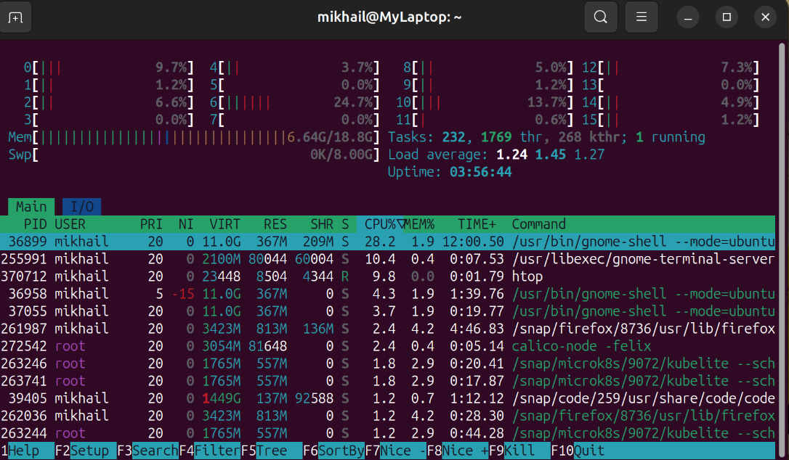

# Load Average в Linux

## LA это?

Это кол-во процессов, которые работают так или иначе в среднем в течении 1, 5, 15 минут. 

Цифры в LA означают сколько ядер загружено. 1 - значит что загружено только одно ядро. Поэтому важно знать сколько ядер в системе для правильной трактовки метрики.

LA- очередь задачь (Процессор + Диск)

> Высокий LA может быть не только из-за CPU

## Как просчитывается LA?

Ядро раз в какое-то время (5 секунд +-) делает снимки того: сколько процессов выполняются и ожидает выполнения. 

Эти показатели складываются, делится на кол-во снимков, фильтрует и получает цифры.

LA отражает общую загрузку системы:
- R (Running/Runnable)
- D (Uninterruptible sleep)

Загрузка процессора же показывает сколько времени загружен процессор именно вычислениями.

## Зачем нужен?

Используют как первичный сигнал чтобы начать искать проблему.

## Команды чтобы посмотреть

```bash
mikhail@MyLaptop:~$ uptime
 14:54:07 up  3:54,  1 user,  load average: 1,79, 1,55, 1,27
mikhail@MyLaptop:~$ top
mikhail@MyLaptop:~$ htop
mikhail@MyLaptop:~$ watch -n1 cat /proc/loadavg
mikhail@MyLaptop:~$ sar -q
```




Команда `nproc` покажет кол-во ядер.