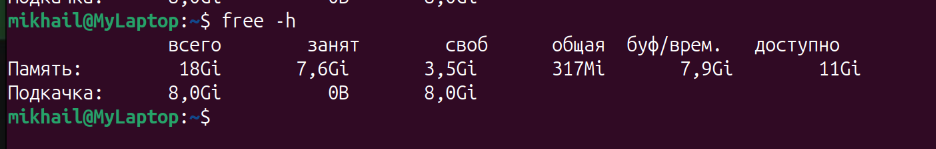
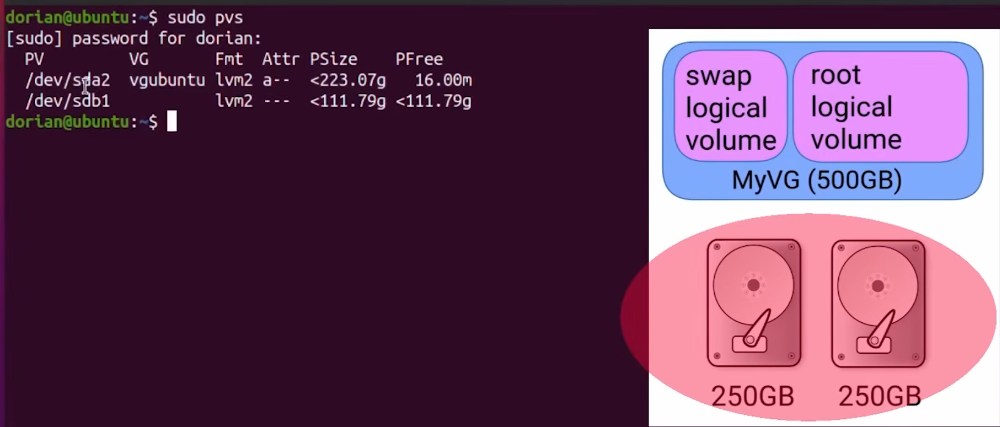
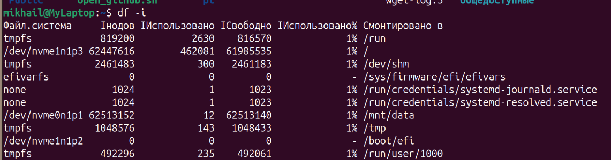

# Топ самых частых вопросов по Linux:
## чем отличается hardlink от symlink?
**Файл** - это inode (структура данных внутри файловой системы). В ext4 одна inode = 256 байт (в ней содержится все про файл: владелец, группа, права доступа, размер, timestamp(когда создан, модифицирован, менялись метаданные), i_links_count (счетчик жестких ссылок), поле i_block на 60 байт (хранятся указатели на реальные данные на диске)). Имя файла содержится в каталоге где хранится имя и номер inode.  
**hard_link** - еще один столбик в каталоге, который указывает на номер inode файла, по факту еще одно имя для файла. При создании hard_link увеличивается счетчик жестких ссылок на 1 в inode, а также добавляется строчка в каталог.
При удалении вызывается система unlink, он удаляет запись из каталога, уменьшает счетчик в inode, данные с диска стираются тогда, когда счетчик ссылок дошел до 0, а также ни один процесс не держит файл открытым. 
Ограничения к hard_link:
- hard_link нельзя сделать через границу файловой системы. Номера inode локальны для каждой файловой системы. 
- нельзя сделать hard_link на каталог. 
  
**Symlink** - это отдельный файл со своей собственной inode и номером, а содержимое этого файла- строка с путем к целевому файлу. 
Причем если путь короткий (до 60 байт), он хранится прямо в поле I_BLOCK вообще без выделения блоков. Это нащывается быстрый SYMLINK.
Для длинных путей выделяется отдельный блок данных. 
Если один symlink содержит путь до другого symlink, то ядро так и будет переходить по цепочке (но есть лимит в 40 переходов. Если за это кол-во шагов не дойдет - вернет ошибку).
У symlink всегда выставлены максимальные права. На Linux они игнорируются и права доступа определяются правами целевого файла, а если его удалить, то symlink станет битым по сути. При этом если  создать новый файл по тому же пути, то symlink заработает, потому что он хранит путь. 

### Когда оба встречаются? 
hard_links в инкрементальных бэкапах (r-снапшоты, r-sink - с флагом link_def).  Суть в том что не измененные файлы получают новый hard_link в новом снапшоте. Экономится куча места на диске.
symlinks- это основы управления конфигурации. Паттерн /SITES-ENABLED и /SITES-AVAIABLE в Nhinx

## чем отличаются права 755 для директории

Уровни доступа для владельца, группы и остальных.
### Что означает execute для каталога?
- бит R - чтение, позволяет прочитать запись из каталога. (без X, с той же командой `ls` покажет только лишь вопросиельные знаки, вместо имен)
- бит X (search) - обращается к inode файлов по имени. 
- бит W - запись, позволяет удалять, переименовывать, создавать файлы внутри каталога. (работает только в связке с X)

### sticky bit
Имеет права 1777, нужно для того чтобы защититть файл от удаления другими пользователями (удалить может root, владелец файла/каталога)
Отображается вот так: drwxrwxrwt

### SGID
2775 - права, отображается как: drwxrwsr-x
Все созданные файлы и каталоги созданные внутри автоматически получают группу каталога, а не группу пользователя, который их создал. 

## что показывает команда free? Что такое buff/cache и availible

исходя из скриншота:
- availible (доступно) - 11Gi - оценка ядра, того, сколько ядро может еще отдать памяти приложениям без того чтобы лезть в SWAP.
  
- buff/cache (буф/врем.) - 7,9Gi - сумма трех вещей: Buffers + Cached + SReclaimable
> Linux придерживается правила: свободная память = потерянная память, зачем память держать пустой, если в нее можно положить что-то полезное => ядро использует всю неиспользуемую память под кэш.   
> **PACHE cache** - это про содержимое файлов. Это основной потребитель памяти везде. Страница в pache cache делятся на чистые и грязные. *Чистые* - совпадают с тем, что уже лежит на диске. *Грязные* - данные еще не доехали до самого диска.  
> **BUFFER cache** - кэширует служебные структуры в файловой системе. Он обычно маленький (200-400 Mb). Без него ядру бы пришлось при каждом обращении к данным - лезть на диск.
- tota; (всего) - 18Gi - обший объем физической памяти - ядро
- free (своб) - 3,5Gi - страницы, которые вообще ничем не заняты
- used (занят) - 7,6 - то, что реально занято процессами
- shared (общая) - 317Mi - TMPFS и разделяемая память
  
### как Linux выделяет память приложениям?
Вообще когда приложение запрашивает память - физическая память не выделяется. Ядро создает VMA (Virtual Memory Area).
Приложению возвращет указатель на адреса где лежит приожение.

**Lazy Location** - процесс, при котором в момент, коогда в память ничинает что-от писаться- из VMA подставляются реальные адреса.

## Что такое LVW и зачем нужен?
**LVM (Logical Volume Value)** - Это прослойка между *физическими дисками* и *файлами*, построенная на трех уровнях:
- **PV (Physical Volume)** - Физическое хранилище, то, диск/раздел, который мы инициализировали для LVM
> На устройство записывается специальная  LVM метка, в которой лежит UUIDи указатель на область метаданны, а все остальное пространство ннарезается на кусочки одинакового размера.
- **VG (Volume Group)** - Объединяет один/несколько PV.
> По сути мы можем взять жесткий диск и сказать ему: "Теперь вот это вс1 одно общее пространство"

> Размер создается при создании и одинаков для всех PV внутри.  
> Каждый PV хранит *полную* копию метаданных всего VG. То есть информация продублирована на каждом физическом диске => если один диск умрет - метаданны не потеряются, потому что они есть на всех остальных.
- **LV (Logical Volume)** - то, с чем мы уже реально работаем: Виртуальные блочные устройства, созданные из свободного пространства VG. Под капотом просто таблица что такой-то логический номер лежит физически там-то. Релизовано через специальный маппер - фреймворк ядра для создания виртуальных блочных устроств.

```bash
pvcreate /dev/sdc #инициализировали новый диск
vgextend vg_sys /dev/sdc #добавили VG
lvextend --resizefs -L +50G /dev/vg_sys/lv_var #расширили том и файловую систему
```

Снапшот - мгновегнная копия данных.

LVM просто выделяет отдельную область на диске и начинает следить за изменениями на оригинальном томе. Как только они произошли - сначала копируют старую версию, потом ее вставляют в нужное место, потом добавляют изменения.

Это техника *Copy-on-Write*.
У нее есть ряд минусов:
1) Каждая новая запись - тройная работа с диском
2) Область для хранения изменений имеет фиксированный размер
3) Thin provisioning

## Что такое strace и когда его применять?
Это **трассировщик системных вызовов**.

Любая программа, которой что-то нужно от ядра (прочитать данные, подключится к сети и тд) отправляет запрос, который перехватывает strace и показывает нам что произошлов результате.

На каждый системный вызов происходит 2 остановки: останавливается, ждет пока strace запишет информацию, продолжает.

### когда оно применяется?
Например запустили приложение - оно не открывается. Логи пустые, ошибки непонятные.
Пишем:

и видите все приложения, которое программа успела открыть при старте или не смогло этого сделать.

Позволяет подключиться к живому вызову чтобы посмотреть на чем процесс застрял:


## Что такое файловые дескрипторы и сколько их может быть?
FD (Файловый дескриптор) - Это просто число, которое ядро выдает процессу, когда тот открывает файл. Дальше процесс работает только с этим числом (прочитай из ..., запиши в ... и т.д.)
Числа начинаются от 3. Почему?

Потому что при запуске любого процесса, ядро создает 3 дескриптора само: 
1) stdin (Дескриптор 0) - стандартный ввод
2) stdout (Дескриптор 1) - стандартный вывод
3) stderr (Дескриптор 2) - стандартный вывод ошибок

У каждого процесса есть своя таблица - по сути массив, где индекс - это номер дескриптора.

Существуют лимиты на дескрипторы:
1) 1024 дескриптора (по-умолчанию).
2) Потолок дескрипторов на процесс.
3) Системный лимит.

## Диск заполнен, но df и du показывают разные цифры. Почему?
du - ходит по дереву каталогов, открывает файл, читает записи, смотрит размер через inode.
df - dspsdftn straatfs и у каталогов спрашивает напрямую сколько блоков всего, сколько занято и сколько свободно. Тут не важно есть ли запись или нет - если занято место, значит занято, даже если какой-то блок держит лишь дескриптор.

## No space left on device, но место есть. Что происходит?
Если пишет, что блоки свободны, но создать файл невозможно - закончилось inode. Команда, которая покажет использование inode:


## Что такое iowait и почему может быть высоким при низком CPU
Iowait - разновидность IDLE - когда процессор *свободен*, но есть хотя бы один процесс ввода-вывода.

Почему выскоим - потому что это и есть низкая загрузка. Процессор простаивает. Но почему высокий - Причины:
- медленный диск
- SWAP
- Приложение просто много работает с диском