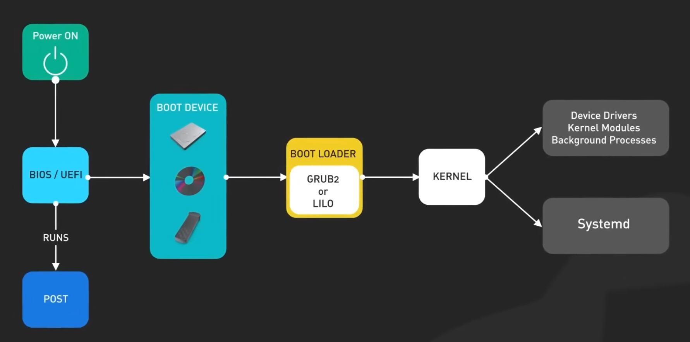

# Устройство линукса

## Уровнь 0
### Железо и нагрузка

1) Процессор просыпается.
2) BIOS/UEFI.  
    2.1. Он запускает P.O.S.T   
    Это POWER-ON SELF-TEST.  
    Он проверяет есть ли память, работает ли видеокарта, инициализировался ли процессор, нашел ли он оперативку.
    Он запускает первые 512 байт диска -  это MBR
3) GRUB. 
    Читает файловую систему. Заглядывает в boot в 2 файла: 
    3.1 vmlinux. GRUB распаковывает этот файл и передает управление.
    3.2 initramfs. Маленький временный архив, разворачивающийся как виртуальный диск, содержащий мини-версию линукса
4) Ядро. Сталкивается с проблемой: Оно уже в памяти, ему нужно смонтировать основной диск чтобы запустить систему, но чтобы смнтировать диск нужны драйвер, а драйверы лежат на диске.
initramfs становится временным корнем, от туда подгружаются драйверы для железа, потом находит реальный диск и делает Pivot root (смена корня). Ядро выкидывает временный диск из памяти и заменяет его настоящим. Если сервер завис с ошибкой 
```bash
KERNEL PANIC:
not syncing: vfs: unable to mount root f5
```
значит что ядро застряло именно на этом моменте.
5) KERNEL SPACE. С точки зрения архитектуры процессора мы находимся в кольце ring 0 (в нем разрешено всё).

   