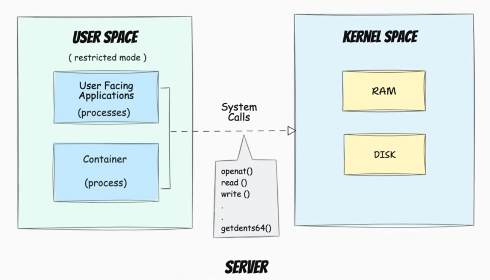
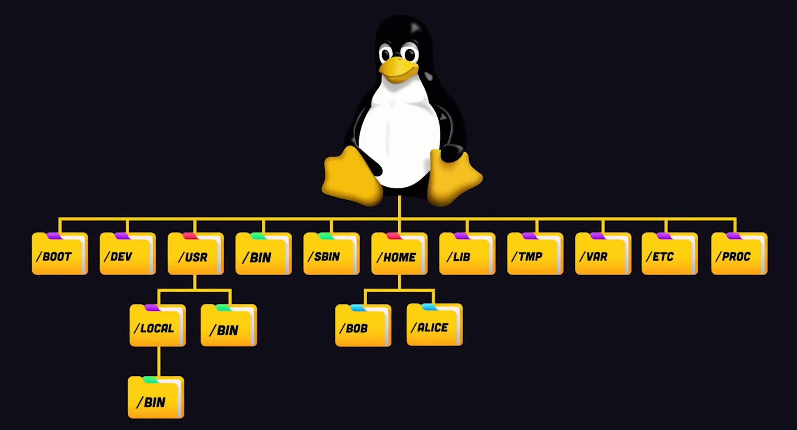
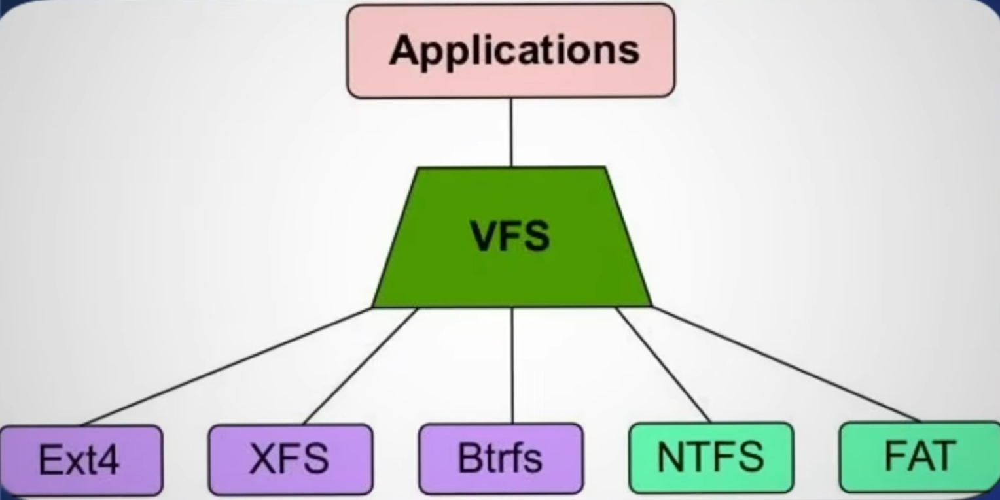
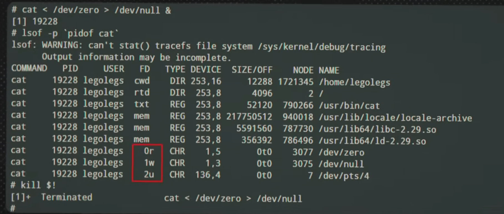
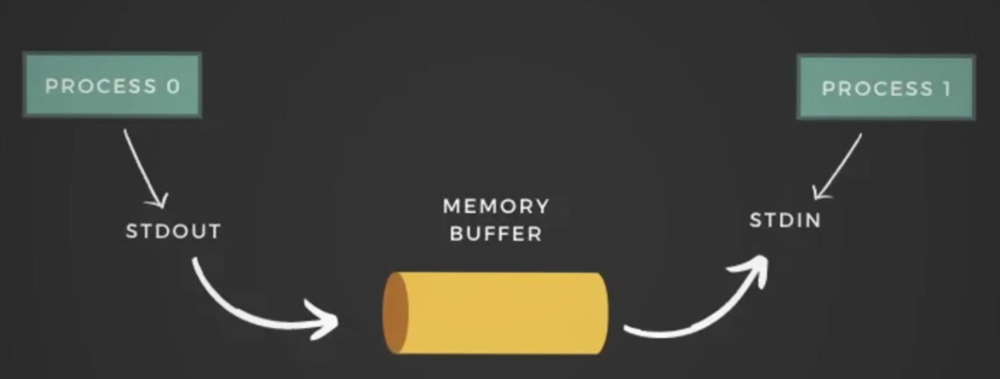
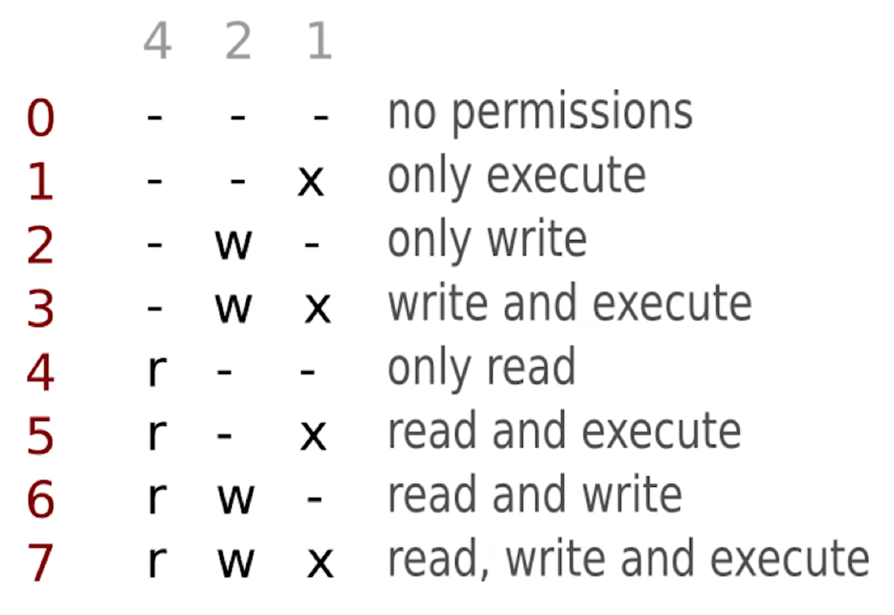
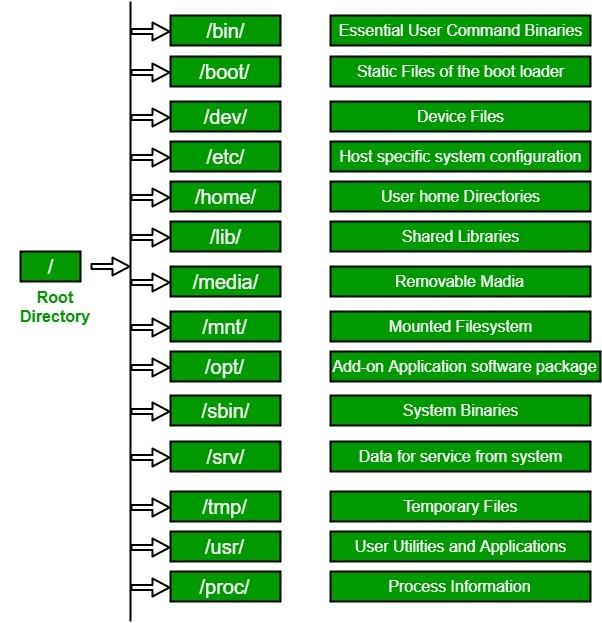

# Устройство Linux

> Систематизированный конспект по архитектуре Linux: от железа до пользовательского пространства.
> Основан на материалах курса и шпаргалке `Linux_prostodevops.pdf`.

---

## 📌 Оглавление

- [Устройство Linux](#устройство-linux)
  - [📌 Оглавление](#-оглавление)
  - [Уровень 0: Железо и загрузка](#уровень-0-железо-и-загрузка)
  - [Задачи ядра Linux](#задачи-ядра-linux)
    - [1. Управление памятью](#1-управление-памятью)
    - [2. Планировщик процессов](#2-планировщик-процессов)
    - [3. Абстракция оборудования (драйверы)](#3-абстракция-оборудования-драйверы)
  - [Системные вызовы (Syscalls)](#системные-вызовы-syscalls)
    - [Основные системные вызовы (сисколлы/syscall)](#основные-системные-вызовы-сисколлыsyscall)
    - [Главный инструмент отладки — `strace`](#главный-инструмент-отладки--strace)
  - [Первый процесс: /sbin/init (Systemd)](#первый-процесс-sbininit-systemd)
  - [Файловая система: VFS и Inodes](#файловая-система-vfs-и-inodes)
    - [VFS (Virtual File System)](#vfs-virtual-file-system)
    - [Inode — индексный дескриптор](#inode--индексный-дескриптор)
    - [Виртуальные файловые системы `/proc` и `/sys`](#виртуальные-файловые-системы-proc-и-sys)
  - [Процессы и потоки ввода-вывода](#процессы-и-потоки-ввода-вывода)
    - [Стандартные файловые дескрипторы](#стандартные-файловые-дескрипторы)
    - [Pipe (`|`) — объединение процессов](#pipe---объединение-процессов)
    - [Аналитическая цепочка](#аналитическая-цепочка)
  - [Права доступа (битовая маска)](#права-доступа-битовая-маска)
  - [User Space и пакетный менеджер](#user-space-и-пакетный-менеджер)
    - [FHS (Filesystem Hierarchy Standard)](#fhs-filesystem-hierarchy-standard)
    - [Dependency Hell](#dependency-hell)
  - [Инструменты отладки Linux](#инструменты-отладки-linux)
  - [Частые ошибки и их значение](#частые-ошибки-и-их-значение)
  - [Архитектура снизу вверх (шпаргалка)](#архитектура-снизу-вверх-шпаргалка)
  - [Итог: цепочка загрузки Linux](#итог-цепочка-загрузки-linux)

---

## Уровень 0: Железо и загрузка

1. **Процессор просыпается** — подаётся питание, начинается выполнение кода из прошивки.

2. **BIOS/UEFI**:
   - Запускает **POST** (Power-On Self-Test) — проверяет память, видеокарту, процессор, оперативную память.
   - Загружает первые **512 байт** диска — это **MBR** (Master Boot Record).

3. **GRUB** (загрузчик):
   - Читает файловую систему, заглядывает в `/boot`.
   - Загружает два файла:
     - **vmlinuz** — сжатое ядро Linux. GRUB распаковывает его и передаёт управление.
     - **initramfs** — временный архив, который разворачивается как виртуальный диск с минимальной средой Linux.

4. **Ядро** сталкивается с проблемой: оно уже в памяти, но чтобы смонтировать основной диск, нужны драйверы, а они лежат на диске.
   - `initramfs` становится временным корнем.
   - Оттуда подгружаются драйверы для железа.
   - Ядро находит реальный диск и делает **Pivot Root** — смену корневой файловой системы.
   - Временный диск выгружается из памяти.

> **Типичная ошибка:**
> ```bash
> KERNEL PANIC: not syncing: vfs: unable to mount root fs
> ```
> Это значит, что ядро застряло на этапе монтирования корневой ФС — не найдена `initramfs` или в ней нет драйвера для диска.

5. **Kernel Space (Ring 0)**:
   - С точки зрения архитектуры процессора мы находимся в **кольце 0** — режиме, где разрешено всё.
   - Если драйвер падает, он утаскивает за собой весь сервер — **Kernel Panic**.


---

## Задачи ядра Linux

### 1. Управление памятью

- Ядро ведёт **таблицу виртуальной памяти** (Page Tables), где хранится соответствие:
  > *«Виртуальный адрес X для процесса Nginx лежит в физической ячейке Y»*

**Это даёт две вещи:**

| Механизм | Описание |
|----------|----------|
| **Изоляция** | Процессы не могут трогать память друг друга. |
| **Своппинг** | Ядро может выгружать данные на диск, если оперативная память закончилась. |

**OOM Killer (Out-Of-Memory Killer)**:
- Если память кончилась и своп переполнен, просыпается OOM Killer.
- Он сканирует процессы, находит того, кто потребляет больше всего памяти и имеет низкий приоритет, и **убивает его**.

### 2. Планировщик процессов

Ядро делит время между процессами с помощью **вытесняющей многозадачности**:

1. Ядро даёт процессу **квант времени**.
2. По истечении кванта процесс **жестко останавливается**.
3. Происходит **переключение контекста** (context switch):
   - Сохраняется состояние текущего процесса.
   - Загружается состояние следующего.
   - Процесс продолжает выполнение.

> Это происходит **~1000 раз в секунду**.  
> **Высокий Load Average** при низком CPU = много переключений контекста.

### 3. Абстракция оборудования (драйверы)

- Ядро выступает **переводчиком** между программами и железом.
- Пользовательские программы ничего не знают о конкретном оборудовании.
- Драйвер ядра говорит программе *«пиши туда»* и переводит команды в электрические сигналы.

> Благодаря этому программы работают одинаково на любом железе.

---

## Системные вызовы (Syscalls)

Между программами (User Space) и ядром (Kernel Space) стоит **стена** — процессор физически запрещает коду из программ трогать оборудование.

> Если программа попытается обратиться к диску напрямую — её убьют с ошибкой:
> ```bash
> Segmentation Fault
> ```

**Железная дверь в этой стене — системный вызов (syscall).**



> *«Ядро говорит: я не пущу тебя, но если ты вежливо попросишь через специальную функцию, я сделаю это за тебя.»*

### Основные системные вызовы (сисколлы/syscall)

| Вызов | Что делает |
|-------|------------|
| `fork()` | Клонировать текущий процесс |
| `exec()` | Заменить процесс на новый |
| `exit()` | Завершить процесс |
| `wait()` | Ждать завершения дочернего процесса |
| `kill()` | Отправить сигнал процессу |
| `open()` | Открыть файл → получить файловый дескриптор (FD) |
| `close()` | Закрыть файловый дескриптор |
| `read()` | Читать данные из FD |
| `write()` | Писать данные в FD |
| `socket()` / `connect()` | Работа с сетью |

### Главный инструмент отладки — `strace`

> **`strace`** — прослушка для системных вызовов.  
> Необходимо уметь читать его вывод!

```bash
strace -p PID    # прослушать syscalls процесса
```

---

## Первый процесс: /sbin/init (Systemd)

1. После загрузки ядра управление передаётся процессу `/sbin/init`.
2. Он получает **PID 1** — все остальные процессы являются его потомками.
3. В современных системах это **systemd**.

**Что делает Systemd:**

| Действие | Описание |
|----------|----------|
| **Монтирование дисков** | Монтирует реальные диски в дерево каталогов согласно `/etc/fstab`. |
| **Определение цели загрузки** | Например, `multi-user.target`. |
| **Запуск сервисов (юнитов)** | `.service` — например, `sshd`, `docker`. |

---

## Файловая система: VFS и Inodes

### VFS (Virtual File System)

> **«Всё есть файл»** — ключевая философия Linux.



- Всё начинается с корня `/`.
- Внутри ядра есть файловая прослойка **VFS (Virtual File System)**.



**Пример прозрачности абстракции:**
- Диск → монтируется в `/boot`.
- Сетевой диск → монтируется в `/mnt/share`.
- Оперативная память → монтируется в `/run`.

### Inode — индексный дескриптор

> Для ядра **имя файла ничего не значит**. Файл — это **inode** (индексный узел).

- В **inode** хранится вся метаинформация о файле, кроме имени:
  - Владелец
  - Права доступа
  - Размер
  - Указатели на сектора на диске

- **Имя файла** живёт в **каталоге** (который технически тоже файл).  
  Внутри каталога — таблица из двух колонок:


| Имя файла | Inode № |
|-----------|---------|
| `file1.txt` | 1 |
| `file2.txt` | 2 |

### Виртуальные файловые системы `/proc` и `/sys`

| Папка | Описание |
|-------|----------|
| `/proc` | Виртуальная ФС с информацией о процессах, CPU, RAM |
| `/sys`  | Виртуальная ФС с информацией об устройствах |

> Это псевдофайловые системы, создаваемые ядром на лету для мониторинга и настройки.  
> Они **не занимают места на диске** и служат мостом между User Space и ядром.

---

## Процессы и потоки ввода-вывода

Когда ядро запускает процесс, оно автоматически открывает для него **три файловых дескриптора**:



### Стандартные файловые дескрипторы

| FD | Имя | Назначение |
|----|-----|------------|
| **0** | `STDIN`  | Клавиатура. Отсюда программа читает данные. |
| **1** | `STDOUT` | Экран. Сюда программа пишет основной вывод. |
| **2** | `STDERR` | Экран. Сюда программа пишет ошибки и логи. |

```bash
# Пример: чтение из /dev/zero, запись в /dev/null
cat </dev/zero > /dev/null &
```

### Pipe (`|`) — объединение процессов



**Pipe** — механизм межпроцессного взаимодействия.  
Стандартный вывод одной команды направляется на стандартный ввод другой.

### Аналитическая цепочка


```bash
cat logs | grep ERROR | sort | uniq | wc -l
```

| Команда | Действие |
|---------|----------|
| `cat logs` | Читает файл логов |
| `grep ERROR` | Оставляет только строки с `ERROR` |
| `sort` | Сортирует строки |
| `uniq` | Убирает дубликаты |
| `wc -l` | Считает количество строк |

---

## Права доступа (битовая маска)

- Для процессора нет имён пользователей.
- Имя пользователя → **UID**.
- Группа → **GID**.
- База данных пользователей и групп хранится в текстовых файлах (например, `/etc/passwd`).

В inode хранится информация о владельце и правах для трёх категорий:

| Категория | Обозначение |
|-----------|-------------|
| **U**ser | Владелец |
| **G**roup | Группа |
| **O**ther | Остальные |

**Права:**

| Буква | Число | Значение |
|-------|-------|----------|
| `r`   | 4     | Чтение (read) |
| `w`   | 2     | Запись (write) |
| `x`   | 1     | Исполнение (execute) |



**Десятичная запись** (3 цифры = владелец, группа, остальные):

```
chmod 755 file
# 7 = rwx (4+2+1)
# 5 = r-x (4+0+1)
# 5 = r-x (4+0+1)
```

**Двоичная запись:**
- `100` = 4 (чтение)
- `010` = 2 (запись)
- `001` = 1 (исполнение)

> **Root-пользователь:** ядро отключает проверку прав.  
> У root всегда **UID = 0**.

---

## User Space и пакетный менеджер

### FHS (Filesystem Hierarchy Standard)

**Пакетный менеджер** — это умный архиватор, который кладёт файлы по стандарту **FHS**.



| Путь | Что там |
|------|---------|
| `/` | Корень |
| `/boot` | Ядро (`vmlinuz`) и `initramfs` |
| `/etc` | Конфиги |
| `/home` | Домашние каталоги пользователей |
| `/root` | Домашний каталог root |
| `/var` | Переменные данные, логи |
| `/usr` | Программы и библиотеки |
| `/bin`, `/sbin` | Системные бинарники |
| `/lib` | Shared библиотеки (`.so`) |
| `/tmp` | Временные файлы |
| `/proc` | Виртуальная ФС (процессы, CPU, RAM) |
| `/sys` | Виртуальная ФС (устройства) |

### Dependency Hell

> Ситуация, при которой версия библиотеки не подходит для всех программ.

**Решение:** пакетный менеджер проверяет зависимости и устанавливает нужные версии.

> **Полезный факт:** программы не содержат весь код.  
> Вместо этого они используют **shared libraries (`.so`)**.
>
> Одна библиотека в RAM используется всеми процессами.

```bash
ldd /usr/bin/nginx
# Покажет зависимости: libssl.so, libz.so, libc.so...
```

---

## Инструменты отладки Linux

| Команда | Что делает |
|---------|------------|
| `strace -p PID` | Прослушка системных вызовов процесса |
| `cat /proc/PID/status` | Информация о процессе |
| `cat /proc/meminfo` | Статистика памяти |
| `cat /proc/cpuinfo` | Информация о CPU |
| `lsof -p PID` | Открытые файлы процесса |
| `ps aux` | Список всех процессов |
| `top` / `htop` | Мониторинг в реальном времени |

---

## Частые ошибки и их значение

| Ошибка | Что означает |
|--------|--------------|
| **Permission denied** | UID процесса не прошёл проверку прав в inode |
| **Segmentation fault** | Процесс попытался обратиться к чужой памяти |
| **No such file or directory** | Путь не существует или нет прав `x` для папки |
| **Too many open files** | Закончились файловые дескрипторы для процесса |
| **Kernel Panic** | Критическая ошибка в Ring 0 (ядро упало) |

---

## Архитектура снизу вверх (шпаргалка)

| Уровень | Что это | Ring |
|---------|---------|------|
| **Железо** | CPU, RAM, диски, сеть | — |
| **Kernel (ядро)** | Память, планировщик, драйверы, VFS | **Ring 0** |
| **Syscall'ы** | ~400 функций-API к ядру | *граница* |
| **User Space** | Systemd, приложения, shell | **Ring 3** |

> **Ring 0** — режим бога, всё разрешено.  
> **Ring 3** — режим пользователя, доступ только через syscalls.

---

## Итог: цепочка загрузки Linux

```
Тупое железо, которое будит BIOS
        ↓
Ядро врет программам, урезает время процессов, управляет драйверами
        ↓
Бетонная стена с небольшим окошком (syscalls), которую никто не проходит
        ↓
Пропуск первого рабочего (systemd), который строит всё окружение
        ↓
Всё пространство организовано в единое дерево, где каждый файл — это просто номер с правами доступа
        ↓
Сидим мы.
```

---

> *Шпаргалка по устройству Linux лежит в pdf формате в той же папке (`Linux_prostodevops.pdf`)*

**Обновлено:** 01.07.2026  
**Автор:** Ivanov_M_V