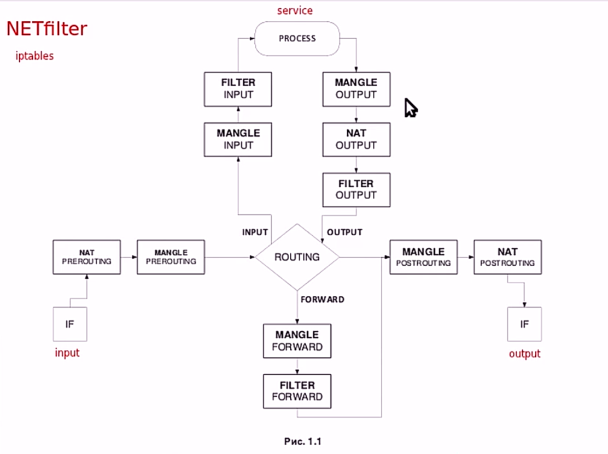
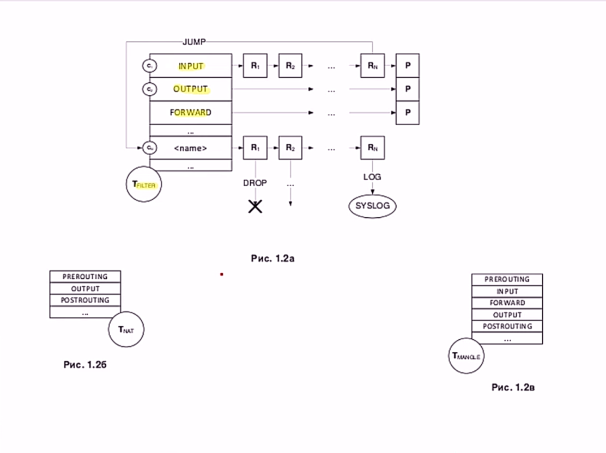

# Пакетная фильтрация

**Пакетная фильтрация** - это механизм, позволяющий фильтровать входящие и исходящие пакеты.
> В основе всего лежит фреймворк Netfilter, а пользовательским инструментом для управления им служит утилита iptables (или её современная замена — nftables)

*NETfilter:*



IF input/output - входящий/выходной интерфейс  
ROUTING - маршрутизация  
NAT - таблица.Используется для изменения частей IP-заголовка пакета (адреса источника или назначения).   
MANGLE - таблица, содержащая изменяющиеся цепочки, но не адреса  
FILTER - ниче не меняет и либо пропускает через себя, либо отбрасывает  



> В iptables вся логика строится на трёх основных уровнях: Таблица → Цепочка → Правило

Утилиты для управления ядром: 
- iptables
- iptables-sava
- iptables-restora

## Как пакет проходит через таблицы и цепочки (Полный путь)
### Сценарий 1: Входящий пакет для локального процесса

Путь пакета:

```text
[Сеть] -> [PREROUTING (mangle)] -> [PREROUTING (nat)] -> [Маршрутизация] -> [INPUT (mangle)] -> [INPUT (filter)] -> [Локальный процесс]
```
Пояснение:

1) Пакет входит через сетевой интерфейс.
2) Сначала попадает в `PREROUTING`, где можно изменить адрес назначения (**DNAT**).
3) После этого система принимает решение о маршрутизации: пакет предназначен для локального хоста.
4) Затем пакет проходит через `INPUT`:
    - Сначала `mangle` (модификация заголовков).
    - Затем `filter`(основная фильтрация: разрешить/запретить).
5) Если пакет разрешён — передаётся локальному процессу.

Пример использования DNAT:

```bash
# Перенаправить входящий трафик на порт 8080 внутрь контейнера на порт 80
iptables -t nat -A PREROUTING -p tcp --dport 8080 -j DNAT --to-destination 10.0.0.5:80
```
### Сценарий 2: Исходящий пакет от локального процесса
Путь пакета:

```text
[Локальный процесс] -> [OUTPUT (mangle)] -> [OUTPUT (nat)] -> [Маршрутизация] -> [OUTPUT (filter)] -> [POSTROUTING (mangle)] -> [POSTROUTING (nat)] -> [Сеть]
```
Пояснение:
1) Локальный процесс генерирует пакет.
2) Сначала пакет попадает в `OUTPUT`:
    - `mangle` — модификация заголовков.
    - `nat` — изменение адреса назначения для локальных соединений.
3) Система принимает решение о маршрутизации (куда отправлять пакет).
4) Снова `OUTPUT`, но уже `filter` — проверка правил исходящей фильтрации.
5) Затем POSTROUTING:
    - `mangle` — финальная модификация.
    - `nat` — изменение адреса источника (SNAT / MASQUERADE).
6) Пакет уходит в сеть.

Пример использования SNAT:

```bash
# Подменить исходящий адрес на IP интерфейса eth0
iptables -t nat -A POSTROUTING -o eth0 -j SNAT --to-source 192.168.1.100
```
### Сценарий 3: Транзитный пакет (хост работает как маршрутизатор)
Путь пакета:

```text
[Сеть] -> [PREROUTING (mangle)] -> [PREROUTING (nat)] -> [Маршрутизация] -> [FORWARD (mangle)] -> [FORWARD (filter)] -> [POSTROUTING (mangle)] -> [POSTROUTING (nat)] -> [Сеть]
```
Пояснение:
1) Пакет входит через один интерфейс.
2) `PREROUTING` — модификация и DNAT при необходимости.
3) Система принимает решение о маршрутизации: пакет транзитный (не для локального хоста).
4) Пакет направляется в `FORWARD`:
    - `mangle` — модификация.
    - `filter` — проверка правил для транзитного трафика.
5) `POSTROUTING` — финальные изменения (SNAT/MASQUERADE).
6) Пакет уходит через другой интерфейс.

Пример включения маршрутизации:

```bash
# Включить пересылку пакетов в Linux
echo 1 > /proc/sys/net/ipv4/ip_forward

# Или сделать постоянным в /etc/sysctl.conf
net.ipv4.ip_forward = 1
```

## 🔍 Как проверить путь пакета вручную
Для отладки можно использовать LOG-правила и смотреть логи ядра:

```bash
# Добавить логирование в каждой цепочке для отслеживания пути
iptables -t mangle -A PREROUTING -j LOG --log-prefix "PREROUTING: "
iptables -t mangle -A INPUT -j LOG --log-prefix "INPUT: "
iptables -t filter -A FORWARD -j LOG --log-prefix "FORWARD: "
iptables -t mangle -A OUTPUT -j LOG --log-prefix "OUTPUT: "
iptables -t mangle -A POSTROUTING -j LOG --log-prefix "POSTROUTING: "

# Просмотр логов
tail -f /var/log/kern.log | grep -E "PREROUTING|INPUT|FORWARD|OUTPUT|POSTROUTING"
```