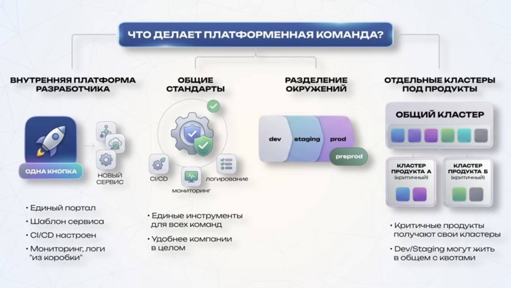
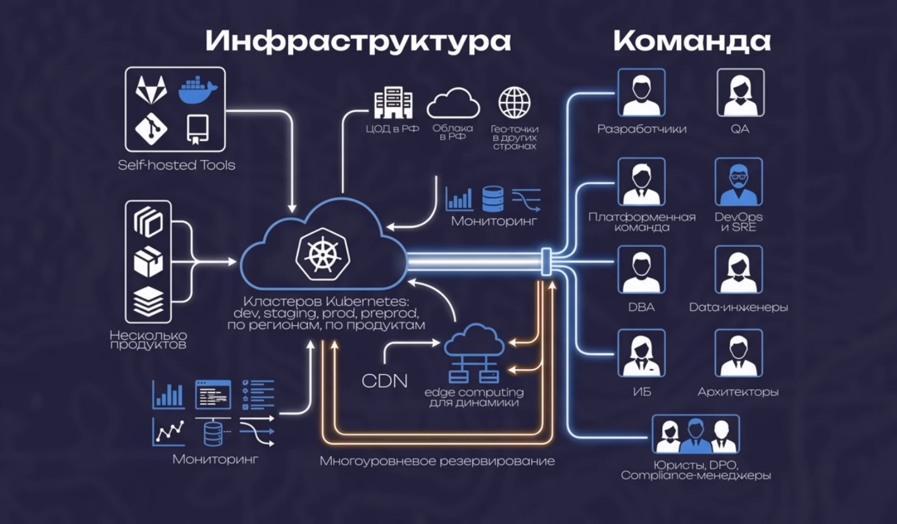

# 📘 Эволюция инфраструктуры IT-продукта

## Оглавление

- [📘 Эволюция инфраструктуры IT-продукта](#-эволюция-инфраструктуры-it-продукта)
  - [Оглавление](#оглавление)
  - [0. Идея](#0-идея)
  - [1. MVP (Minimum Viable Product)](#1-mvp-minimum-viable-product)
    - [Действия:](#действия)
    - [Результат:](#результат)
  - [2. Первые пользователи → первые боли](#2-первые-пользователи--первые-боли)
  - [3. Команда растёт](#3-команда-растёт)
    - [Появляются:](#появляются)
  - [4. База данных](#4-база-данных)
  - [5. Крупные клиенты → требования по надёжности](#5-крупные-клиенты--требования-по-надёжности)
    - [Что делаем:](#что-делаем)
    - [Логи централизованно:](#логи-централизованно)
  - [6. Постмортемы и автоматизация](#6-постмортемы-и-автоматизация)
    - [CI/CD эволюционирует:](#cicd-эволюционирует)
    - [Инфраструктура как код:](#инфраструктура-как-код)
    - [Безопасность:](#безопасность)
    - [Мониторинг:](#мониторинг)
    - [Трассировка:](#трассировка)
  - [7. Платформенная команда](#7-платформенная-команда)
    - [🔧 Что делает платформенная команда:](#-что-делает-платформенная-команда)
      - [ВНУТРЕННЯЯ ПЛАТФОРМА РАЗРАБОТЧИКА](#внутренняя-платформа-разработчика)
      - [ОБЩИЕ СТАНДАРТЫ](#общие-стандарты)
      - [РАЗДЕЛЕНИЕ ОКРУЖЕНИЙ](#разделение-окружений)
      - [ОТДЕЛЬНЫЕ КЛАСТЕРЫ ПОД ПРОДУКТЫ](#отдельные-кластеры-под-продукты)
  - [](#)
  - [8. Новые роли и задачи](#8-новые-роли-и-задачи)
  - [9. Юридическое регулирование](#9-юридическое-регулирование)
  - [10. Мировой масштаб](#10-мировой-масштаб)
    - [Решения:](#решения)
    - [Где размещать инфраструктуру?](#где-размещать-инфраструктуру)
  - [🧠 Итог](#-итог)

---

## 0. Идея

У тебя есть приложение, которое работает локально.  
Ты хочешь показать его миру → нужен выход в интернет.

---

## 1. MVP (Minimum Viable Product)

> «Я — стартапер, девопс, сисадмин и продакт в одном лице»

### Действия:
- Аренда **VPS** (виртуального сервера)
- Покупка **домена** и настройка **DNS**
- Развертывание приложения (голый сервер / Docker)
- Настройка **TLS** (SSL-сертификат)
- Установка **Nginx** как веб-сервера и прокси

### Результат:
Приложение доступно в интернете.

---

## 2. Первые пользователи → первые боли

| Проблема | Решение |
|----------|---------|
| Сервер упал ночью — сайт лежал 6 часов | Мониторинг + автоперезапуск (systemd, cron, healthcheck) |
| Диск забит логами или данными | Ротация логов, увеличение диска, очистка |
| Нет бэкапов | Регулярный бэкап БД и файлов, хранение вне сервера |
| Страшно деплоить в прод | Создаём **Dev-копию прода** — тестируем всё там |

---

## 3. Команда растёт

### Появляются:
- Разработчики (несколько человек)
- Потребность в контроле версий → **GitHub / GitLab**
- Разграничение прав доступа (админ → полный доступ, разработчики → ограниченный)
- **Тикет-система** (Trello, Notion, YouTrack) — задачи, приоритеты, сроки

---

## 4. База данных

**Проблема:** БД и приложение на одном сервере → тормоза.

**Решение:**
- Перенос БД на отдельный сервер
- Соединение через **приватную сеть** (VLAN / VPC)
- Nginx становится **полноценным реверс-прокси**:
  - сжатие ответов
  - кэширование статики
  - лимит запросов с одного IP

---

## 5. Крупные клиенты → требования по надёжности

**Uptime 99.9%** = максимум **8 часов простоя в год**.

### Что делаем:
- Добавляем **несколько серверов**
- **Балансировщик нагрузки** (Nginx / HAProxy / облачный LB)
- **Репликация БД** (Master → Replica). Если Master падает — Replica становится Master (без даунтайма)
- **Отдельный сервер для статики** (или объектное хранилище S3)
- **Собственный registry образов** (Harbor, Nexus, GitLab Registry) — чтобы не зависеть от Docker Hub

### Логи централизованно:
Graylog, Grafana Loki, ELK-стек.

---

## 6. Постмортемы и автоматизация

**Инциденты фиксируются**, разбираются, чтобы не повторялись.

**Ручное управление — невозможно** → внедряем:
- **Kubernetes** / Docker Swarm / Ansible + Docker
- Инфраструктура описывается в **манифестах** (как должно быть)

### CI/CD эволюционирует:

```text
Тесты → Линтеры → Безопасность → Сборка → Пуш в registry → Деплой на Dev → E2E-тесты → Деплой на Staging → Ручная проверка → Деплой на Prod
```
### Инфраструктура как код:
Terraform / Ansible — управление конфигурацией серверов (всё по шаблонам).

### Безопасность:
- HashiCorp Vault для секретов
- Каждый сервис — свои секреты

### Мониторинг:
- Prometheus + Grafana + AlertManager
- Не только системные, но и бизнес-метрики

### Трассировка:
Jaeger / Tempo — видим путь каждого запроса между сервисами.

## 7. Платформенная команда

> Команд много, каждая строит инфру по-своему → хаос.

**Платформенная команда** не делает продукт, она создаёт **инструменты для разработчиков**.

---

### 🔧 Что делает платформенная команда:

#### ВНУТРЕННЯЯ ПЛАТФОРМА РАЗРАБОТЧИКА
- **ОДНА КНОПКА**
  - Единый портал
  - Шаблон сервиса
  - CI/CD настроен
  - Мониторинг, логи "из коробки"

#### ОБЩИЕ СТАНДАРТЫ
- CI/CD
- Общие окружения
  - Единые инструменты для всех команд
  - Удобнее компании в целом

#### РАЗДЕЛЕНИЕ ОКРУЖЕНИЙ
- dev
- staging
- prod
- preprod

#### ОТДЕЛЬНЫЕ КЛАСТЕРЫ ПОД ПРОДУКТЫ
- **КЛАСТЕР ПРОДУКТА А** (критичный)
- **КЛАСТЕР ПРОДУКТА Б** (критичный)
- Dev/Staging могут жить в общем с квотами


---

## 8. Новые роли и задачи

| Роль | Задачи |
|------|--------|
| **DBA** | Администрирование БД, репликация, оптимизация |
| **QA-инженеры** | Разработка тестов для пайплайнов |
| **ИБ (InfoSec)** | Пентесты, WAF, 2FA, аудит доступов, управление секретами, проверки безопасности в CI/CD |

**WAF** — фильтрует HTTP-трафик (SQL-инъекции, XSS, подозрительные паттерны).

---

## 9. Юридическое регулирование

**Законы диктуют архитектуру:**

- Закон о персональных данных (152-ФЗ в РФ, GDPR в ЕС)
- Стандарты для обработки платежей (PCI DSS)
- Право на забвение, согласие на обработку, уведомления об утечках

**Несоблюдение → огромные штрафы.**

---

## 10. Мировой масштаб

> Продукт используют во всём мире → нужно, чтобы везде открывалось быстро.

### Решения:
- **CDN** (кеширование статики по всему миру)
- **Мульти-региональный деплой** (сервера в разных регионах)
- **Геораспределённые БД** — сложная задача:
  - Синхронизация с задержкой (асинхронная репликация)
  - Шардирование по регионам (россияне → РФ, американцы → США)

---

### Где размещать инфраструктуру?

| Вариант | Плюсы | Минусы |
|---------|-------|--------|
| **Облако** | Быстро, платишь по факту, легко масштабировать | Дорого на больших объёмах, зависимость от провайдера |
| **Bare Metal** | Полный контроль, дешевле при росте | Капитальные затраты, нужна команда под железо, долгий ввод мощностей |
| **Гибрид** | Критичное — на железе, остальное — в облаке | Сложность управления |

---

## 🧠 Итог

> **Каждый компонент появился на конкретную боль.**  
> Сложность никто не проектировал — **она выросла сама**.

**Архитектор инфраструктуры** — держит в голове всю эту карту целиком.
