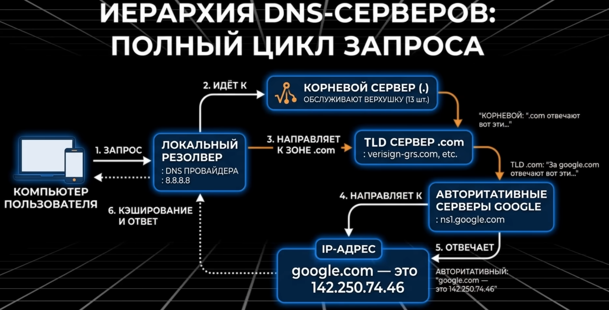
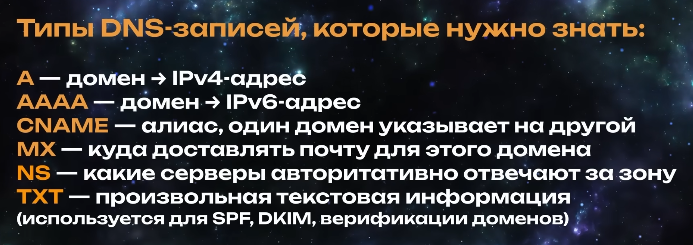
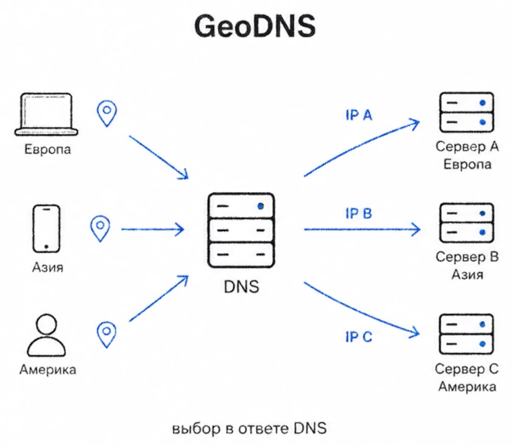
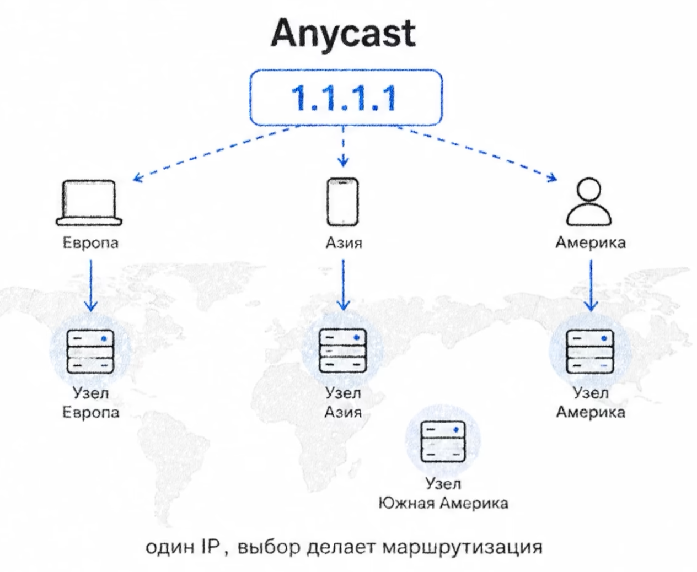
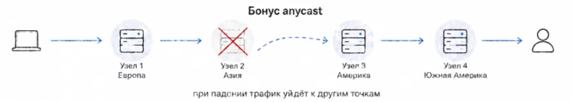

# Конспект по сетям
# 📚 Оглавление
- [Конспект по сетям](#конспект-по-сетям)
- [📚 Оглавление](#-оглавление)
  - [Сеть](#сеть)
  - [Модель OSI](#модель-osi)
  - [Модель TCP/IP](#модель-tcpip)
  - [Сетевые устройства и технологии](#сетевые-устройства-и-технологии)
  - [Простые протоколы](#простые-протоколы)
  - [HTTP, TLS, SSL, DNS](#http-tls-ssl-dns)
    - [TLS](#tls)
    - [SSL рукопожатие](#ssl-рукопожатие)
    - [DNS](#dns)
  - [Протоколы удаленного доступа к ОС TELNET и SSH](#протоколы-удаленного-доступа-к-ос-telnet-и-ssh)
    - [Шаги настройки TELNET:](#шаги-настройки-telnet)
    - [Шаги настройки SSH:](#шаги-настройки-ssh)
  - [Протоколы FTP и TFTP](#протоколы-ftp-и-tftp)
    - [Настройка FTP-сервера:](#настройка-ftp-сервера)
    - [Работа FTP-клиента (общий принцип):](#работа-ftp-клиента-общий-принцип)
    - [Настройка TFTP-сервера:](#настройка-tftp-сервера)
    - [Работа TFTP-клиента (на примере сетевого устройства Cisco):](#работа-tftp-клиента-на-примере-сетевого-устройства-cisco)
  - [VLAN](#vlan)
  - [Отказоустойчивые каналы связи](#отказоустойчивые-каналы-связи)
  - [Протокол STP, PAgP, LACP. EtherChannel это](#протокол-stp-pagp-lacp-etherchannel-это)
  - [Маршрутизация это](#маршрутизация-это)
  - [BGP](#bgp)
    - [Работает на уровне Автономных Систем (AS)](#работает-на-уровне-автономных-систем-as)
    - [Отличие](#отличие)
    - [Как работает](#как-работает)
  - [Отличие EIGRP от OSPF. Как вычесляется маршрут?](#отличие-eigrp-от-ospf-как-вычесляется-маршрут)
  - [Технология NAT](#технология-nat)
  - [Списки доступа ACL](#списки-доступа-acl)
  - [Логический и физический адрес в компьютерных сетях](#логический-и-физический-адрес-в-компьютерных-сетях)
  - [Межсетевой экран. Инспектирование трафика. CiscoASA](#межсетевой-экран-инспектирование-трафика-ciscoasa)
    - [Схожесть и различие с роутером:](#схожесть-и-различие-с-роутером)
  - [Wi-Fi](#wi-fi)
    - [Способы использования Wi-Fi](#способы-использования-wi-fi)
  - [VPN. Протоколы IpSEC и GRE](#vpn-протоколы-ipsec-и-gre)
  - [SYSLOG и NTP серверы](#syslog-и-ntp-серверы)
  - [AAA сервер. Протоколы RADIUS и TACAS. DMZ](#aaa-сервер-протоколы-radius-и-tacas-dmz)
  - [TCP и UDP](#tcp-и-udp)
  - [GeoDNS/GEO-steering](#geodnsgeo-steering)
  - [ANYCAST](#anycast)
  - [CDN](#cdn)
## Сеть
Сеть - это совокупность устройств, соединенных друг с другом 
для передачи информации логически или физически.  
Интернет - многофункциональный способ использования глобальной сети.  
Вся сетевая инженерия по сути - это набор протоколов,
где каждый следующий решает проблему, которую не решил предыдущий.

Порядок такой:  
Твой пк -> роутер -> провайдер -> магистральный оператор (уже IXP - точки обмена трафика) -> сервер -> сайт

## Модель OSI
Это модель, описывыающая как работают сетевые устройства.
- **Прикладной уровень.**
    - Сетевые службы, приложения (http, smtp).
- **Уровень Представления.**
    - Преобразование форматов сообщений: сжатие, кодирование (jpeg, gif). Происходит преобразование в нужный формат из 0 и 1.
- **Сеансовый уровень.**
    - Управление соединениями.
    - Определение каким кодеком будет кодироваться сигнал.
    - Это уровень аудио и видео конференций.
- **Транспортный уровень.**
    - Передача данных по сети.
    - TCP и UDP.
- **Сетевой уровен.**
    - IP-адреса.
    - Маршрутизация трафика.
    - Устройства: маршрутизатор, отправка DNS запроса и получение IP-адреса, интернет и глобальная сеть.
- **Канальный уровень.**
    - Проверка и исправление передач сигналов.
    - Добавление адресов отправителя и получателя. MAC-адрес устройства на канальном уровне.
    - Устройства: коммутатор, мост.
- **Физический уровен.**
    - Передача сигналов (кабели, концентратор, репиторы).
  
*Инкапсуляция* - когда данные идут от нижнего уровня к верхнему.  
*Деинкапсуляция* - обратный процесс. 

1) Данные передаются по кабелям в виде 0 и 1
2) Данные каждого устройства (MAC-адрес + данные) запихиваются в конферт "Кадры"
3) На третьем уровнен все помещается в еще один конверт с IP-адресом.
4) На транспортном уровне добавляются порты от 0 до 65535, где каждому порту соответствует свой процесс. 

## Модель TCP/IP
Если OSI модель это эталон, то в реальности интернет работает по именно TCP/IP модели.
- **прикладной  уровень** (Равен уровням прикладному + сеансовому + представления)
- **Транспортный уровень** (Равен транспортному уровню)
- **Сетевой уровень** (Равен сетевому уровню)
- **Канальный уровнь** (Объединяет физический и канальный)

## Сетевые устройства и технологии
1) AutoMDT - технология автоматического подключения на устройствах.
2) Концентратор (Hub) - дубляция на все выходы, это устройство канального уровня.
3) Маршрутизатор - это роутер, устройство сетевого уровня. Предназначено для перессылки пакетов из одной канальной среды в другую. Выбирает лучший маршрут для пакета. Передача данных между сетями; соединение домашних, внешних, глобальных, локальных сетей; разделение сети на подсети.
4) Модем - для входа в сеть на основе телефонных линий.
5) Межсетевой экран - устройство,    - Преобразование форматов сообщений: сжатие, кодирование (jpeg, gif). Происходит преобразование в нужный формат из 0 и 1. отвечющее изначально за безоопасность, в отличие от роутера.
6) VLAN - структура сети, объединяющая компьютеры, используется для обеспечения безопасности, низкое количество широковещательного трафика.
7) Повторитель (Repeater) - это устройство физического уровня. Усиливает ослабленный электрический сигнал и передает его дальше. Работает только с потоком битов.
8) Коммутатор (Switch) - это устройство канального уровня. Соединяет узлы сети. Сохраняет назначения и пересылает пакет к нужному порту + отбрасывает лишние данные.
   
## Простые протоколы
1) HTTP - Протокол для передачи веб-страниц. 80-й порт. Работает по модели "клиент-сервер"
2) HTTPS - Защищенная версия http протокола. 443-й порт.
3) DNS - распределенная система, преобразующая доменные имена (например google.com) в IP-адреса. 53-й порт.
4) DHCP - автоматически назначает IP-адреса и другие сетевые параметры (маску, шлюз, DNS и т.д.) при подключении устройств к сети.
5) SMTP - протокол для передачи электронной почты между серверами от клиента к серверу. Использует 25-й и 587-й порты.
6) POP3 - протокол для загрузки электронной почты с сервера на утройство клиента. После загрузки почта обычно удаляется с сервера. Порт 110.
7) IMAP - протокол для управления почтой непосредственно на сервере (позволяет синхронизировать сосояние писем между разными устройствами: прочитано/удалено). Порт 143.  
> Письма IMAP на сервере, там он их и оставляет.  
> POP3 на локальном устройстве, удаляет с сервера письма.
8) ARP (Address Resolution Protocol) - протокол, сопоставляющий IP-адрес с MAC-адресом.
                                                     

## HTTP, TLS, SSL, DNS
В http есть специальные статус коды

Популярные методы протокола HTTP:
1) GET (получить данные)
2) POST (Отправить данные)
3) PUT (обновить данные)
4) DELETE (удалить данные)

### TLS
Это криптографический протокол.   
Он оборачивает не только http, но и любой другой протокол в шифрованный туннель. Клиент и сервер перед передачей данных проходят TLS рукопожатие.

Тот же HTTP + TLS = HTTPS.

### SSL рукопожатие
1) Клиент оправялет "ClientHello" (сообщает какие алгоритмы шифрования он поддерживает) + SNI (имя сервера, к которому пытается подключиться)
2) Сервер отвечает сертификатом. Присылает свой публичный ключ. Все это можно проверить чтобы убедиться в том что сервер действительно тот, за кого себя выдает.
3) Клиент проверяет сертификат, стороны генерируют общий секретный ключ. С этого момента всё зашифровано.

Таким образом тот же провайдер с помощью SNI видит куда вы зашли, но он не знает что мы, как пользователи, там делаем, ни паролей, ничего.

### DNS                                                        
  

## Протоколы удаленного доступа к ОС TELNET и SSH
TELNET - протокол удаленного доступа к компонентам сети, передающий все данные (включая логины и пароли) в **незашифрованном** виде. Порт 23. *Небезопасен*.
SSH - протокол удаленного доступа к компонентам сети с **шифрованием** трафика. Порт 22. Стандарт, *безопасен*.

### Шаги настройки TELNET:
1) Настроить базовые параметры: Задать имя устройства (hostname), и доменное имя (ip domain name)
2) Настроить IP-адрес. Назначить на виртуальном интерфейсе (например VLAN 1), чтобы у коммутатора был адрес для подключения.
3) Создать пользователя. Добавить пользователя с паролем в локальную базу данных коммутатора для аутентификации (username ... secret ...). 
> secret - имеет шифрование  
> password - не имеет шифрования
4) Перейти в режим настройки виртуальных линий (VTY) - это специальные "логические" порты для удаленных подключений.
5) Настройка количества одновременных сессий (line vty 0 15). По базе 16 - это максимальное количество на современных устройствах, но бывает меньше, бывает больше.
6) Назначить метод аутентификации: указать что для входа нужно использовать локальную базу данных (login local).
7) Разрешить TELNET-подключения: разрешить что на этих виртуальных линиях разрешен протокол TELNET (transport input telnet).
   
### Шаги настройки SSH:
1) Задать доменное имя для самого устройства (на роутере или коммутаторе) (ip domain-name local.domain)
2) Сгенерировать криптографические ключи: Ключи (пары RSA) необходимы для шифрования (crypto key generate rsa 2048). 
> 1024/2048/4096 - чем больше бит, тем надежнее ключ, но тем больше он нагружает процессор.
3) Перейдем в режим настройки виртуальных линий.
4) Создаем пользователя для SSH, если он не создан (username admin privilege 15 secret admin123).
> Чем больше привилегия, тем больше возможностей (максимум 15). 
5) Назначить метод аутентификации: указать аутентификацию по локальной базе (login local).
6) Разрешить ТОЛЬКО SSH-подключения и ЗАПРЕТИТЬ  TELNET (это важно!): Указать что на виртуальных линиях разрешен только протокол SSH (transport input ssh) - это команда автоматически запрещает небезопасный TELNET.

## Протоколы FTP и TFTP
FTP - протокол для передачи файлов с **аутентификацие** (логин/пароль). Использует TCP-порты 20 (для данных), 21 (для команд).  
TFTP - просой протокол для передачи файлов без **аутентификации**. Использует UDP-порт 69. Используется для автоматических задач, таких как: загрузка операционных систем на бездисковой станции, резервное копирование конфигураций системных устройств, загрузка файлов конфигурации, загрузка обновления.

### Настройка FTP-сервера:
1) Включение сервиса FTP.
2) Создание пользователя (имя, пароль, привилегии).
3) Проверить подключение подинтерфейса к серверу. 

### Работа FTP-клиента (общий принцип):
1) Подключение: Клиент (например браузер, FileZila Client или командная строка).
2) Аутентификация: имя и пароль.
3) Передача файлов: После успешного входа клиент может совершать действия в соответствии со своими привилегиями.

### Настройка TFTP-сервера:
1) Включение сервиса TFTP.

### Работа TFTP-клиента (на примере сетевого устройства Cisco):
1) Копирование файла. Указать от куда и куда (copy flash: tftp).
2) Указать имя и расширение копируемого файла (config.text).
3) Указать куда копировать (IP address: 192.168.17.57).
4) Указать под каким именем сохранить (config.text).

## VLAN
**VLAN** - это виртуальная локальная сеть, которая позволяет логически сегментировать физическую сетевую инфраструктуру на несколько широковещательных доменов.

Преимущества VLAN: повышение безопасности, снижение широковещательного трафика, логическая группировка по функциям, упрощение управления сетью.

Access Port (порт доступа) - это порт коммутатора для подключения конечных устройств, работает с ОДНИМ VLAN. Тег VLAN отсутствует.

Trunk Port (магистральный порт) - это порт коммутатора для соединения между сетевыми устройствами. Пропускает трафик нескольких VLAN. Тег IEEE 802.1Q.

Пример использования:  
по Access Port: Используется в офисной сети, где устройства в одной VLAN.  
по Trunk Port: Используется для связи между коммутаторами разных офисов находящихся в разных VLAN.   

## Отказоустойчивые каналы связи
**Отказоустойчивые каналы связи** - это технологии обеспечение непрерывной работы сети при сбоях, которые достигаются автоматическим переключением на резервные пути с помощью протокола STP, предотвращающего возникновение петель - опасных циклических маршрутов, где данные бесконечно циркулируют по сети, вызывая ее перегрузку, а также технологии EtherChannel для объединения физических каналов в 1 логический с повышением пропускной способности и надежности.

**Агрегированный канал** - это технология объединения нескольких физических сетевых интерфейсов (портов) в один логический канал для увеличения: пропускной способности и отказоустойчивости.

**Ручное агрегирование** - настраиваемое сисадмином портов без протоколов контроля.

**Динамическое агрегирование** - это уже автоматическое объединение портов с использованием протокола LACP, который самостоятельно согласует параметры и контролирует состояния канала.

## Протокол STP, PAgP, LACP. EtherChannel это
Протокол STP (Spanning Tree Protocol) - это протокол канального уровня, предотвращающий возникновение петель - циклических маршрутов передачи данных, приводящих к широковещательному шторму и коллапсу сети, путем выбора одного активного пути и блокировки остальных, что создает древовидную топологию без петель, где заблокированные порты автоматически активиру.тся при отказе основного канала.

STP избавляется от петель путем логического блокирования избыточных портов, оставляя в сети только один активный путь между устройствами: 
1) Выбор корневого коммутатора (по принципу меньшего идентификатора).
2) Определение ролей портов на некорневых коммутаторах.
3) Выбор назначеннвх портов.
4) Блокировка остальных портов.

> Состояние портов: блокировка, прослушивание, обучение, передача.

**EtherChannel** - это технология, позволяющая объединять (агрегировать) несколько физических проводов (каналов, портов) в единый логический интерфейс.   
Используется для повышения отказоустойчивости и увеличения пропускной способности канала. Для агрегирования необходимо чтобы порты были одинаковыми (Скорость, дуплекс, VLAN-настройки, тип интерфейса, настройки STP ...).

PAgP и LACP - это 2 разных протокола для динамического создания агрегированных каналов (EtherChannel/LAG), которые отличаются не только производителем, но и возможностями.

**PAgP** - это проприетарный протокол Cisco, поддерживающий до 16 активных портов и резервные каналы.

**LACP** - это открытый стандарт (IEE 802.3ad) с межвендорной совместимостью, где максимально 8 активных портов из 16 возможных.

Характеристики для агрегирования каналов:
1) физические параметры (скорость, дуплекс).
2) VLAN-настройки.
3) топологические требования (подключены к одному устройству, порты одного типа).
4) протокольные требования (отсутствие конфликтующих протоколов, для статического LAG полное ркчное совпадение конфигураций, для LACP совместимы режимы Active-Active, Active-Passive).
5) Диапазон разрешен VLAN.
6) thinking status.

Статическая агрегация каналов - ручная настройка (отсутствие дополнительных задержек при поднятии канала)

## Маршрутизация это
**Маршрутизация** - это процесс определения пути передачи сетевого трафика от источника к получателю через промежуточные узлы (маршрутизаторы).

**Статическая маршрутизация** - это метод маршрутизации, при котором администратор вручную прописывает в таблицу маршрутизации каждого маршрутизатора конкретные пути к сетям назначения.    
Эти маршруты неизменны и не обновляются автоматически.   
Применяется в небольших сетях, для маршрутов по умолчанию или когда нужен полный контроль.  

Плюсы:
1) безопасность
2) предсказуемость
3) нет служебного трафика

Минусы:
1) не адаптируется к сбоям
2) не масштабируется
3) высокая трудоёмкость администрирования

**Динамическая маршрутизация** - это метод, при котором маршрутизаторы автоматически обмениваются информацией о топологии по специальным протоколам (RIP, OSPF, EIGRP) и самостоятельно вычисляют оптимальные пути.   
Таблицы маршрутизаии обновляются динамически при любых изменениях сети.   
Применяется в средних и крупных сетях.   

Плюсы:
1) автоматическая адаптация к сбоям
2) масштабируемость
3) отказоустойчивость

Минусы:
1) сложнее в настройке и безопасности

Протоколы динамической маршрутизации бывают внутренние (eBGP, iBGP) и внешние (OSPF, RIP).

Внешние: осуществляют маршрутизацию сежду автономными системами AS (группа роутеров под общим управлением).

## BGP
Один из известнейших протоколов маршрутизации, обеспечивающий работу интернета как единой сети. 

### Работает на уровне Автономных Систем (AS)
Интернет разбит на Автономные Системы (AS) — это большие сети под единым управлением, например, наш интернет-провайдер, крупная компания или облачный сервис. 
У каждой AS есть уникальный номер (ASN). 
BGP работает именно между этими AS, обмениваясь информацией о том, какие сети (IP-адреса) находятся внутри каждой из них

### Отличие
Вместо простого "расстояния" или "стоимости", как во внутренних протоколах (RIP, OSPF), BGP передает полный путь до сети в виде списка номеров AS, который называется AS_PATH. 

### Как работает 
1) Надежное соединение: BGP использует TCP (порт 179) для обмена сообщениями, поэтому ему не нужно думать о потерянных пакетах.

2) Обмен информацией: Сначала соседи обмениваются всей своей таблицей маршрутизации. После этого — только изменениями (дельтами), что экономит ресурсы.

3) Типы сообщений: Есть несколько типов сообщений, но основные — UPDATE (для объявления новых и отзыва старых маршрутов) и KEEPALIVE (чтобы сказать "я еще жив", обычно раз в 30–60 секунд)

## Отличие EIGRP от OSPF. Как вычесляется маршрут?
Еще раз, это 2 протокола динамической маршрутизации.

**EIGRP** (динамически-векторный) хранит самый короткий маршрут, а также резервные маршруты.  
Это неэквивалентная балансировка (балансирует между маршрутами с разной метрикой).   
Проверка есть ли резервный маршрут. Пропускная задержка + пропускная способность.   
Работает только в Cisco, так как проприетарный.

**OSPF** (протокол состояния канала) строит полную карту сети и уже находит кратчайший путь.   
Вычисляет стоимость маршрутов сам заново.  
На основе ip-адреса или вручную выбирается главный маршрутизатор.   
Работает везде, полностью открытый.  

**Дистанционно-векторный протокол** - это тип рпотокола маршрутизации, в котором каждый маршрутизатор переодически рассылает соседям ***полную таблицу маршрутов*** (или её часть), указывая направление (вектор) и расстояние (метрику, например, количество переходов - hop count) до каждой сети.   
RIP, EIGRP, IGRP - протоколы

**Протокол состояния канала** - эт тип протокола маршрутизации в котором каждый маршрутизатор расслыает информацию ***только о состоянии своих непосредственно подключенных каналов*** (линков), а затем самостоятельно строит полную карту топологии и вычисляет оптимальные пути по алгоритму (например Дейкстры).   
OSPF, IS-IS - протокоы

## Технология NAT
Технология преобразования сетевых адресов. NAT позволяет одному публичному IP-адресу представлять целую частную сеть с множеством устройств в интернете.   
Экономит IPv4-адреса, скрывает внутреннюю топологию.  
Переписывает адреса, позволяя устройствам вызодить в интернет через один IP.

Белый IP - публичный IP-адрес (IPv4). Доступны из любой точки мира. Покупают у провайдеров.
Серый IP - частный IP-адрес.

**Статический NAT** - это постоянное однозначное соответствие одного частного IP-адреса одному публичному.    
Один интерфейс - один IP, у каждого устройства свой IP белый.

**Динамический NAT** - это автоматическое временное сопоставление частных адресов из пула с публичными адресами из другого пула, используемое для мнжественного выхода в интернет.   
Преобразование серого адреса в один из белых адресов.

**Перегруженный NAT (PAT)** - это преобразование множества частных IP-адресов в один или несколько публичных с использованием уникальных номеров портов для идентификации сессий, что позволяет экономить публичные адреса.   
Если кратко: Несколько серых в один белый.

## Списки доступа ACL
Набор правил, которые разрешют или запрещают трафик на сетевом устройстве (фильтрация трафика).   
Принимает пакеты по заданным критериям и принимает решение (permit/deny).   
Проверка идет сверху вниз, первое совпадение приостанавливает проверку.  
AccessList принимает в 2-х направлениях: входящий или исходящий трафик.

Используется пакетная фильтрация, NAT, VPN, разрешение доступа к оборудованию, QoS (приоритезация трафика).

**Стандартный ACL** фильтрует трафик *только по IP-адресу источника*, использует номера 1-99 или 1300-1999, его параметры: номер, действие (permit/deny), Ip-адрес источника и wildcard-маска, с неявным deny any в конце.

**Расширенный ACL** *фильтрует по протоколу, IP-адресу источника и назначения, портам*, использует номера 100-199 или 2000-2699, его параметры: номер, действие, протокол, адрес источника, адрес назначения и порт/сервис.

**Нумерованный ACL** идентифицируются по номеру, позволяют только добавлять правила.

**Именованный ACL** идентифицируются по имени, поддерживают произвольное удаление и вставку правил, а также описательные комментарии.

**Рефлексивный ACL** список, блокирует доступ (позволяет TCP ответам проходить через частную сеть, зпщищает от нессанкционированного доступа при открытых сессиях).

## Логический и физический адрес в компьютерных сетях
2 разных типа идентификаторов устройств в сети, работающие на разных уровнях.

**Физический (MAC-адрес)**: Уникальный "серийный номер", Канальный уровень, для доставки кадров между непосредственно соединенными устройствами в одной подсети.

**Логический (IP-адрес)**: Адрес устройства в сетевой иерархии, Сетевой уровень, для маршрутизации трафика между разными сетями через интернет. Оптимизирует маршрутизацию.

## Межсетевой экран. Инспектирование трафика. CiscoASA
**Межсетевой экран (брандмауэр)** - это сетевое устройство, которое контролирует и фильтрует трафик между доверенной внутренней сетью и ненадежными внешними сетями (например, Интернетом) на основе заданных правил безопасности.   
Обеспечение удаленного доступа.

**Инспектирование трафика (Stateful Packet Inspection)** - это метож, при котором межсетевой экран не только проверяет отдельные пакеты по IP-адресам и портам, но и отслеживает состояние сетевых соединений, запоминая контекст сессий.   
Это позволяет принимать более умные решения: пропускать только легитимные пакеты в рамках установленыых соединений и блокировать подозрительную активность, не соответствующую нормальному поведению протоколов.

### Схожесть и различие с роутером:
Межсетевой экран по функционалу схожь с маршрутизатором:
1) поддерживает динамическую маршрутизацию
2) NAT
3) ACL
4) VPN

Но у роутера нет дополнительные функций, какие есть у межсетевого экрана:
1) Инспекция трафика (Пример с лифтами. Распишу позже как-нибудь).
2) IDFW - взаимодействие с доменами директории.
3) TrustSec - использование меток безопасности для трафика.
4) Улучшенные VPN.
5) IPS - анализ трафика на аномалии, проверка логов и предотвращение вторжений.

Отсутствуют:
1) BGP
2) MPLS
3) DMVPN
4) GRE
5) WLAN Controller

## Wi-Fi
**Wi-Fi** - это технология беспроводной локальной сети (WLAN), основанная на стандартах IEEE 802.11 и позволяющая устройствам обмениваться данными без проводов с помощью радиоволн.

В основе работы лежит ***модуляция*** - процесс преобразования цифровых данных в радиосигнал (на частотах 2,4 ГГц, 5 ГГц) и обратной демодуляци в пункте приёма.

Wi-Fi использует *частотные каналы* с определённой *шириной канала* - обычно 20 МГц, но также поддерживаются более широкие каналы 40, 80, 160 МГц для увеличения скорости передачи.

В диапазоне 2,4 ГГц доступно всего 3 непересекающихся канала (номера 1,6,11), что часот приводит к помехам в плотных сетях.

В диапазоне 5 ГГц число непересекающихся каналов достигает 19-25 (в зависимости от региона и поддержки DFS).

Для повышения эффективности передачи используется технология MIMO (Multiple Input Multiple Output), которая подразделяется на:
1) SU-MIMO - передача данных на одно устройство в конкретный момент времени.
2) MU-MIMO - одновременная передача на несколько устройств.

### Способы использования Wi-Fi
Способы использования различаются по задачам:
1) Точка доступа (Access Point) - обеспечивает беспроводной доступ к локальной сети, но не выполняет маршрутизацию.
2) Wi-Fi роутер - совмещает точку доступа с функциями маршрутизатора, подключается к интернет-провайдеру и раздает интернет подключенным устройствам.
3) Wi-Fi мост (Wireless Bridge) - служит для беспроводного соединения двух сегментов локальной сети, например зданиями, без прокладки кабелей.

Основные преимущества Wi-Fi - мобильность, отсутствие проводов и простота развертывания сети.

Недостатки - более низкая, чем у проводных соединений, безопасность и стабильность, подверженность помехам и ограничения по дальности.

Wi-Fi широкоприменяется в домашних и офисных сетях, общественных хот-спотах, для разгрузки сетей мобильных операторов, в системе "умного дома", торговых центрах и т.д., где важна гибкость и доступность беспроводного подключения.

## VPN. Протоколы IpSEC и GRE
Зашифрованный туннель через публичную сеть. Сокрытие IP-адреса путем ***НАЛОЖЕНИЯ*** другого IP-адреса поверх старого, передача его к VPN-серверу.   
Способ удаленного доступа к локальной сети через публтичную.

Site-to-site - поднятие тунеля между двумя локальными сетями.   
Remote access - подключние к удаленной сети одного устройства.

**GRE**: задача туннелирование, нет шифрования, нет аутентификации, маленький заголовок, выше производительность.  
**IPSec**: задача безопасность, шифрование, аутентификация, большой заголовок, ниже производительность, защищает факт договора. Бывает тунельный и транспортный.

Построение тунеля происходит в 2 фазы:
1) 2 стороны по протоколу (не договариваются о парамтерах соединения).
2) договор об IPSec туннеля.

## SYSLOG и NTP серверы
**Логи** - системные сообщения.  
Методы сбора логов:
1) Терминал
2) Консоль
3) Буфер
4) Syslog
5) SNMP Traps
6) AAA accounting

**SYSLOG**: централизованная система сбора логов со всех сетевых устройств, серверов, приложений.   
Мониторинг, диагностика проблем, анализ атак, архивирование логов.  
Имеет 7 уровней работы:
1) emergency - система недееспособна
2) alert - основные модули вышли из строя
3) critical - вспомогательные модули вышли из строя
4) error, warning - потенциальные проблемы
5) notice - информирование об обработке от сервиса
6) informational - создан vlan, поднята сессия
7) debug - каждое действие сообщается

Чаще всего работает 6 уровень. Записи либо архивируются и удаляются, либо перезаписываются во избежание переполнения. UDP - 514 порт.

**NTP (network time protocol)**: синхронизация времени на всех устройствах сети с точностью до миллисекунд.   
Также позволяет ускорять время, если системное вдруг остает, чтобы все запланированные по времени действия отработали корректно. UDP - 123 порт.

## AAA сервер. Протоколы RADIUS и TACAS. DMZ
**AAA сервер (Authentication Authorizations Accounting)** - сетевая база пользователей.   
Система централизованного управления доступом к устройствам и сервисам.   
Контроль доступа, отчетность, безопасность.

**RADIUS**: протокол UDP, шифрует только пароль, доступ пользователей (Wi-Fi, VPN), огромная поддержка устройств, быстрее из-за UDP и меньшей нагрузки.  
Везде поддерживается.

**TACACS**: протокол TCP, шифрование всего пакета, административный доступ к сетевым устройствам, поддержка Cisco.

На одном устройстве может работаь оба протокола.

**DMZ** - демилитаризованная зона (область сети, с доступом в общедоступные сервисы).

Сервер в DMZ имеет белый публичный IP-адрес.

Для реализации DMZ сетевые устройства должны иметь возможность запоминать сессии.

## TCP и UDP
Это протоколы транспортного уровня, их задача доставить данные от процесса к процессу. 
**TCP** - Протокол надежной доставки. На нем происходит знаменитой трехстороннее рукопожатие:
1) SYN - отправляет клиент серверу
2) SYN-ACK - отправляет сервер клиенту
3) ACK - отправляет клиент серверу

Используется там, где критически важно не потерять данные:
1) http
2) ssh
3) бд
4) передача файлов

**UDP** - полная противоположность TCP. Нет рукопожатия, нет подтверждений о том что данные доставлены и в случае ошибок не будет повторных отправок.Он ненадежный, но очень быстрый.

Используется при стримминге например
Это не конец. Конспект будет продолжен.

## GeoDNS/GEO-steering
Штука, которая определяет место от куда был послан запрос на подключение, передает адрес ближайщего к нему сервера. 

Правда сервер не видит нас напрямую, а видит скорее DNS-сервер нашего провайдера. Resolver - тот самый посреднкик. И решение о выбере сервера идет исходят из этого посредника.

**ECS (EDNS Client Subnet)** - расширение DNS протокола, которое позволяет передавать часть IP-адреса клиента DNS-резолверу и далее — авторитетному DNS-серверу.

Вместо IP резолвера сервер видит подсеть клиента (например, /24) и выдаёт ответ, оптимальный для реального местоположения пользователя.

## ANYCAST
Одну и ту же подсеть (например 1.1.1.1 или 8.8.8.8) обслуживает множество серверов. По факту это выглядит как куча равноправных путей, а BGP выбирает самый оптимальный и близкий

RPKI - криптографическая подпись маршрута.

## CDN 
Сеть доставки контента. CDN ставит свои ноды но всему миру.

Как он работает?
- Ты открываешь ютуб ролик 
- идет DNS-запрос и выбирается ближайшая точка с помощью Anycast и GeoDNS
- CDN на этой точке входа имеет копию твоего ролика, поскольку до вас его смотрели тысячи других людей рядом с вами
- наши тяжелые данные идут не с другого конца планеты, а с ближайшей кэш ноды.

В итоге минимальная задержка, а также дешевый трафик для всех в цепочке. 
